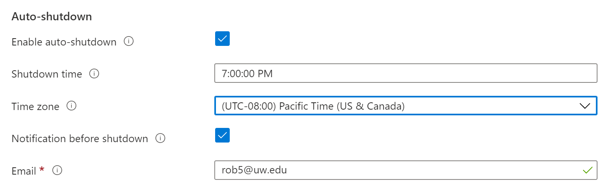

# Creating a VM image: Azure cloud

## Introduction

Virtual Machines (VMs) are computers. 


Technical detail: They are operating systems installed as hermetic
environments on computers; so there is a level of abstraction above the basic computer + operating system; 
and this is why we have the term *virtual* involved. A single physical computer may host more than one
Virtual Machine. 


On the cloud we select a VM by choosing both a ***type*** and an ***operating system***. The type
matches the computer's purpose to processing power, memory, network speed and other features. A bigger
VM costs more per hour on the cloud, be that cloud Azure or AWS or GCP or some other platform.


Technical detail: The operating system *actually* selects a pre-built *image* which includes
said operating system. The image loads into the VM as a *blank slate*: Just the operating system, 
an empty user directory, no additional content. We log in as this generic user and go from there.


The small VM we use here costs $0.12 per hour or about $14 per day; so this leads us to a first
rule: Stop the VM when it is not in use. This is like turning off a laptop: Everything persists;
and it is no longer consuming electricity, incurring hourly charges. **Start** and **Stop** for a VM
are distinct from **Terminate**. When we terminate a VM it evaporates; it is gone. 


#### VM Concept and Plan including Jupyter Notebook servers


A Jupyter notebook server is a research tool in common use at this time. It is a popular component 
of the research ecosystem. We will include one of these in this construction process. 


A researcher installs and runs a Jupyter notebook server on a VM as a step in building
a research workspace. Commonly the programming language in use in these notebooks is 
Python. 


Python also features a level of virtualization in what are called *virtual environments*. 
The Python *base* environment is the Python interpreter and libraries that comprise the
basic Python installation. This base environment is a distinct concept from the Jupyter
notebook server. From this base or default environment a Python (virtual) environment 
is often built to further customize the workspace. A virtual environment is an isolated 
space in which additional libraries are installed.


To connect this together as a narrative we can say that we...

* ...choose a particular cloud (Azure) on which to build a research space
* ...identify and start up a Virtual Machine (VM) with an associated hourly cost
* ...log in to this VM using credentials we received in the start-up process
* ...install Python and a Jupyter Notebook server
* ...create a virtual Python environment and in that context install additional Python libraries
* ...import some test data to the VM file system from object storage (see below)
* ...import some test code to the VM file system from GitHub (see below)
* ...execute Python code found in *cells* of the Jupyter notebooks


#### Object storage versus block storage

A "disk drive" or "storage drive" is a fairly large block of read/write memory associated directly with 
a file system on a computer. On a cloud VM this is known as block storage and it includes two sub-types. 
First there is the root file system that includes the VM operating system, in our case Ubuntu Linux. 
Second there can be additional attached block storage devices often called data drives. These will tend 
to feature larger storage capacity. 

The cloud also features a second type of storage called object storage. On Azure this is called *blob* 
storage. Objects in object storage may be files. However they are not treated as files that can be 
opened and read through (indexed) in search of some particular segment of information. This is in contrast
to block storage where they can. Object storage or blob storage does support reasonably high connectivity speed; 
so object storage is an extension of the computing environment. ***Object Storage...***

- ...is by design virtually infinite in capacity
- ...is cheaper per byte per month than block storage
- ...features fast connection speed but not as fast as block storage attached to a VM
- ...allows us to read an object (say a file) directly into computer memory
- ...allows us to copy an object (say a file) to block storage
- ...does not allow us to "open and access" the contents of an object (say a file)
- ...blobs can be files, collections of files, entire folder trees, entire block storage file systems, or entire VMs


In terms of cloud computing design patterns: Object storage is a cost-effective way of storing data.
*Specifically* data that need not be accessed immediately; but has some future intended use.


Technical note: There are cheaper forms of object storage as well that presume very low data access rates.
These are used for archival data storage and are sometimes called 'cold storage*.


#### GitHub


GitHub is a provider of Internet hosting for software development and version control using **`git`**. 
(source: Wikipedia) **`git`** is in turn a Linux software version control utility. GitHub and similar hosting
sites are in common use as a means of sharing software solutions particular to open and reproducible research.
There are in consequence two important aspects of GitHub use relevant to use of public clouds like Azure. 


1. It is common practice to use the **`git`** command to clone GitHub *repositories*, which are 
thematic collections of files contained in a directory structure. However there are a number of
details in learning to use **`git`** effectively: This means there is a proper and necessary 
**`git`** learning curve.


2. Improper use of GitHub can result in cloud access keys landing in an open repository. There are malevolent 
code bots in operation on GitHub that will use such inadvertently open keys to mine bitcoin on cloud VMs. This
costs actual money that is charged to the cloud User. Typical spend rates for this scenario are USD 15,000 per 
hour; so it is important to avoid committing access keys to GitHub repositories.


#### Plan


"As if we are doing some research" the sequence of events in this walk-through are:


- Start a VM on the Azure cloud
- Install the Anaconda data science platform (Python with Jupyter notebook server support)
- Install some additional Python libraries
- Download some data
- Download a Jupyter notebook repository
- Make sure everything works properly
- Save the results as an Azure VM **image**
- Shut down ("terminate") the VM
- Start a completely new VM from the stored image
- Again test that everything works properly


Note: There is a distinction between a virtualized computer or virtual machine (VM) and an actual physical 
computer. While this is outside the scope of this material it can be relevant within the general topic of 
compute optimization.


## Background perspective


There are three degrees of complexity in building a compute resource on the cloud. Actually there are
more than this but let's start with three: **Functions**, **Containers** and **Images**. Functions are simplest
but they have a limited degree of power and flexibility. Images are the most complicated; they correspond
to Virtual Machines. In fact Images are like a freeze-dried (or if you like 'zip file') version of a VM.
Containers occupy a middle ground between Functions and Images. We are visiting all three with the idea 
of seeing a spectrum of options for doing data science on the cloud. 


## Walk-through

This procedural walks you through creating a working Virtual Machine with a Jupyter notebook server, testing it, 
and storing it as an Azure machine image. That last step is a single click task; the bulk of the effort is 
the preparation. This walk-through uses the [Azure portal](portal.azure.com), a browser-based interface to
the services available on the Azure cloud. 


* Using a browser sign in to the [Azure portal](portal.azure.com) and identify/select an Azure *Resource Group*
    * A Resource Group (abbreviated RG) is a logical/virtual container for associated Azure resources
    * As an example an RG might contain a Virtual Machine (VM), a monitoring service and a Storage Account
    * RGs are associated with regions; and should be created in a region near to your geographic location
    * If you do not have an RG available you can use the Azure portal to **Create** a new one
* Below is a portal screencapture showing a Resource Group list: Just one Resource Group is present
    * This RG will contain a Virtual Machine and associated resources: That's the goal.

<BR><BR>


<BR><BR>

* Select the RG and click the `+Add v`
    * This is so we can add a Virtual Machine to the RG


<BR><BR>


<BR><BR>

* The `+Add v` gives us a drop-down. Select `Marketplace`. 
    * This is where we can get Ubuntu Linux VM images at no cost
    * Don't need to enter anything in the search bar: The Ubuntu Server choice is just there.

<BR><BR>


<BR><BR>

* Select from the Marketplace an Ubuntu Server image. 
    * Notice that an *image* is what we set out to build... and here is one already built for us so that was easy 
        * We select an "empty" image that includes nothing more than the Ubuntu operating system
        * Once the Virtual Machine running Ubuntu Linux is running we customize it

<BR><BR>


<BR><BR>

* Click `Create`
    * This means "Initiate the process of starting a VM using this Ubuntu operating system"
    * "LTS" means Long Term Support, i.e. the OS will be supported by Ubuntu for a "long time".

<BR><BR>


<BR><BR>

* This brings us to a multi-step VM builder wizard. 
    * We will work through the multiple tabs fairly quickly, mostly using default values
    * On the first tab: Enter a machine name and choose the small default Size from the dropdown. 
        * This reads `Standard_D2s_v2 - 2 vcpus, 8 GiB memory ($70.08/month)`
        * The monthly cost for a VM choice is a good sanity check; 'if I leave it running 24/7'
        * The remaining entries in the first wizard tab: Defaults are fine
        * Notice the default username is `azureuser` which is fine
        * Notice we allow an inbound port 22 which is associated with the secure shell, **`ssh`**

<BR><BR>


<BR><BR>

* Click **Next : Disks >** to arrive at the **Disks** tab of the VM wizard. 
* Add a 32GB disk to create some data capacity on this VM

<BR><BR>


<BR><BR>
   
* Note: A 256GB drive is shown. 
    * This will run 8 x the cost of a 32GB disk
    * Rule of thumb: Choose disk size based on anticipated data volume
    * You can increase / decrease disk volume at a later time as well
    * This is a managed disk: Costs more, less hassle, backups, encryption etcetera

<BR><BR>


<BR><BR>

* Once disk volume is selected you can (**Ok**) confirm you want to **Create a new disk**.

<BR><BR>


<BR><BR>


* Next are *Networking*, *Management* and *Advanced* tabs: Keep defaults 

<BR><BR>


<BR><BR>


<BR><BR>
   
* Set the VM to **Stop** at 7PM. Turn it on using the Portal or CLI when needed.
   


<BR><BR>

* **Tags** tab: Include some tags so that an account administrator knows what these resources are for.

<BR><BR>


<BR><BR>

* At the **Review and Create** tab we get a sense of what will be built
    *  It will cost 10 to 12 cents per hour to operate (more for larger disk volumes) 


<BR><BR>
   


<BR><BR>

The link "download a template for automation" allows you to generate VMs in this format automatically rather than by hand.


<BR><BR>

   


<BR><BR>

* The pop-up dialog shown above gives us authentication options
    * Download an SSH key pair file to ensure you will be able to access the VM 
    * We use this rather than using { username + password }
    * Place the keypair file in a secure location on your local computer
        * Ensure that it will not accidentally end up copied to GitHub
    * We will refer to this file as **`fu.pem`**
    * Change the read-write-execute permissions of `fu.pem` to `r--------` or `0400` in octal
        * The Linux command to do this is:

```
chmod 400 fu.pem
```

- You run `ssh` using the `fu.pem` file to connect from your laptop to the Azure VM you just created.
- You can do this in **Visual Studio Code** using an Ubuntu terminal (bash shell). 
- Windows users also can use PuTTY, a free SSH client
    - but this comes with a bit of a learning curve

<BR><BR>


* Here is the "Deployment complete" message you should see once the VM has been launched
* Click on **Go to resource**


<BR><BR>


<BR><BR>


* We then see a lot of the details of operation of this newly-created VM:


<BR><BR>


<BR><BR>

* In the above VM description notice there is nothing present under **Azure Spot**
    * **Azure Spot** is an option you can choose that significantly reduces the cost of the VM
    * The catch is that there is a small chance you may be evicted from the VM
    * Read about "cloud spot markets" to learn more


* Note the above information includes an ip address for this VM. 
    * In the example above the ip address is `138.91.145.112`
    * In what follows let us suppose:
        * The ip address is `111.22.33.44`
        * The `.pem` SSH keypair file is `fu.pem`
        * The username is the default `azureuser`


* Move the keypair `fu.pem` file to your local directory, `chmod` and login to the Azure VM
    * My command sequence for this: On Windows; in VSCode; on the Ubuntu TERMINAL; is...

```
(base) rob5> cd
(base) rob5> mv /mnt/c/Users/rob5/Downloads/fu.pem .
(base) rob5> chmod 400 fu.pem
(base) rob5> ls -al fu.pem

-r-------- 1 kilroy kilroy 2494 Apr 26 08:13 rob5vm3_key.pem

(base) rob5> ssh -i fu.pem azureuser@111.22.33.44

(respond 'yes' to 'is this ok?')

azureuser@rob5vm3:~$ 
```


* You should now have a tell-tale prompt: `azureuser@machimename:~$ `
    * The primary cause of this step not working is the `0400` permission for the `.pem` file was not set (see above).


## Optional: Mount data drive

In the VM configuration we added a data drive. During class we suggest skipping the next step of mounting this 
drive for use. If you are familiar with the process it should be straightforward. If not we recommend doing this
outside of class time as a stretch activity. 


* Next step is to mount the data disk we added during the VM creation process 
    * This was not done automatically
    * The command to get started is `lsblk -o NAME,HCTL,SIZE,MOUNTPOINT`
    * Notice that the 256 GB disk is listed as `sdc` but it has no mount point as yet


<BR><BR>


> Please notice that the 256GB drive (or 32GB drive) in the above is associated with the NAME `sdc`. 
> This may instead by `sdb` so please note which one for use in the following mount commands.


***Completely Optional Aside***: Don't do this if you have limited time available! 
Here is a *green text on a black background customization [link](https://robfatland.github.io/greenandblack/)*. 


<BR><BR>


* Follow directions for mounting a disk on an Azure VM
    * [How-to documentation](https://docs.microsoft.com/en-us/azure/virtual-machines/linux/attach-disk-portal)
    * Based on this the following commands were used to mount the data disk
    * Notice this is for **`NAME=sdc`**. You must modify these commands if **`NAME=sdb`** per above.


```
sudo parted /dev/sdc --script mklabel gpt mkpart xfspart xfs 0% 100%
sudo mkfs.xfs /dev/sc1
sudo partprobe /dev/sdc1
sudo mkdir /datadrive
sudo mount /dev/sdc1 /datadrive
sudo blkid
```

* You can verify the mount by re-running `lsblk`: A mount point should be present now.
* Change directories to the data disk and ensure you can edit, save and modify a test file.
    * You may need to `sudo chmod` the `/datadrive` to make it read/write-able.
* Note the documentation on all of this provides links to additional documentation.

<BR><BR>
   
 <BR><BR>

   

<BR><BR>


# Re-starting a VM

If your earlier session was interrupted and your Virtual Machine was set to auto-halt
every day at 7PM it may currently be Stopped. It can be restarted easily:
in the Azure portal: Find the Resource Group and therein the Virtual Machine.
Select the Virtual Machine and click the **Start** button at the top of the center panel.
Note the new ip address for the VM.


# Customizing the environment

We have a working VM; so let us now import code and data, install some Python libraries,
and run a Jupyter notebook server in our hypothetical quest to become oceanographers.


In what follows, commands are run on the Azure VM bash command line. 
Above: We logged into the Azure VM from a local computer like a laptop using a VSCode terminal.
Once the Jupyter notebook server is running in `--no-display` mode: We return to our local computer 
to set up an ***ssh tunnel*** and use this to connect our local browser to the Azure VM Jupyter 
notebook server. 


* Customizing the Virtual Machine is five steps
    * Install the Anaconda Python platform: Choose the current Linux package from [this page](https://www.anaconda.com/products/individual).
    * Install the `xarray` library
    * Install the `netcdf4` library
    * `git clone` a GitHub repository { Jupyter notebooks, small dataset }
    * Start the Jupyter notebook server in `--no-browser` mode


### Install Anaconda

The following example uses the correct link as of April 7 2021:


```
wget https://repo.anaconda.com/archive/Anaconda3-2020.11-Linux-x86_64.sh
bash Anaconda3-2020.11-Linux-x86_64.sh
```

* This gets the Anaconda installation file using the `wget` command; then installs it using `bash`
    * You can also opt to install a lighter-weight version called Miniconda 
* Accept the license agreement and the defaults, initializer etc; install takes a couple of minutes

<BR><BR>


<BR><BR>


<BR><BR>
   
* Definitely log out and then log back in to your VM for "changes to take effect".

<BR><BR>


<BR><BR>
   


At this point the Jupyter notebook server should be available for use


### Install two Python libraries

```
conda install xarray 
pip install netcdf4
```


### Clone a GitHub repository

```
cd ~
git clone https://github.com/robfatland/ocean
ls ocean
```

This creates a folder (repository) called `ocean` in your home directory.


If you ran this `git clone` before today (Wednesday 28-APR-2021) you may 
wish to refresh your copy of the repository: 

```
cd ~
pwd
rm -rf ocean
git clone https://github.com/robfatland/ocean
ls ocean
```

Note the use of the `-rf` switches in the `rm` command causes a recursive deletion. If used in the wrong place it can
delete entire file systems; so use this with caution.


### Start the Jupyter notebook server

```
(jupyter notebook --no-browser --port=8889) &
```

The ampersand `&` at the end of this command starts the Jupyter notebook server as a background job.
Notice that the Jupyter notebook server will "listen" on port 8889.
You can log out of the Azure VM but first copy the token string for the Jupyter notebook server.
It looks like this: `token=ae948dc6923848982349fbc48a2938d4958f23409eea427`


## Test the Jupyter notebook server from your local browser


* On your local computer/laptop bash command line run


```
ssh -N -f -i fu.pem -L localhost:7005:localhost:8889 azureuser@111.22.33.44
```

In this command: Make the appropriate substitutions for your `.pem` filename and your VM ip address.
This creates a secure (**`ssh`**) tunnel from port 7005 of your local computer to port 8889 of the Azure VM.

In the browser address bar enter `localhost:7005`
When prompted: Enter the token string you copied above
On success: The Jupyter notebook server will appear in your browser
Navigate to the `ocean` folder/repository and run the first notebook listed.  
   
   
<BR><BR>


<BR><BR>

## Create a machine image in the Azure portal

* Select the VM in the Azure Portal and click **Capture**

<BR><BR>


<BR><BR>

* The "make image" wizard comes up.
* On the side dialog select No, capture only a managed image

<BR><BR>


<BR><BR>
   
* The VM stops and the image creation process starts up. 
* Shortly thereafter (minutes) we have an image of the VM available. 
    * This VM image can be restarted on small low-cost machines or large high-cost machines
    * It can be shared with colleagues or made publicly available
    * The image is static. If you make changes to the VM you must re-Capture the image to keep it up to date if you so desire


<BR><BR>


* Try starting the notebook **Ocean 01 A etc** and running the first few cells.

## Concluding remarks


The Virtual Machine configuration took up the bulk of this effort. The VM *image* was a rather
trivial final step. This image is a "safe backup" of the VM. 


* Leaving a VM running when not in use is very common practice, also expensive. 


* We access VMs as shown here over the internet using the `fu.pem` keypair file. This file
should be kept in a secure location away from GitHub respository directories. 

* A backup copy of a keypair file stored in another 
secure location might come in handy. Azure has a security service for managing access keys called 
**Key Vault**; worth knowing about but beyond the scope of this tutorial.


* In this walk-through we created a data disk. These attached drives cost $0.10 / GB / month, approximately.


* A running Virtual Machine has an ip address. These may be fixed or permanent; or they may change 
each time the VM is re-started. The former is more convenient; see Azure Static Public IPs for more on this.


