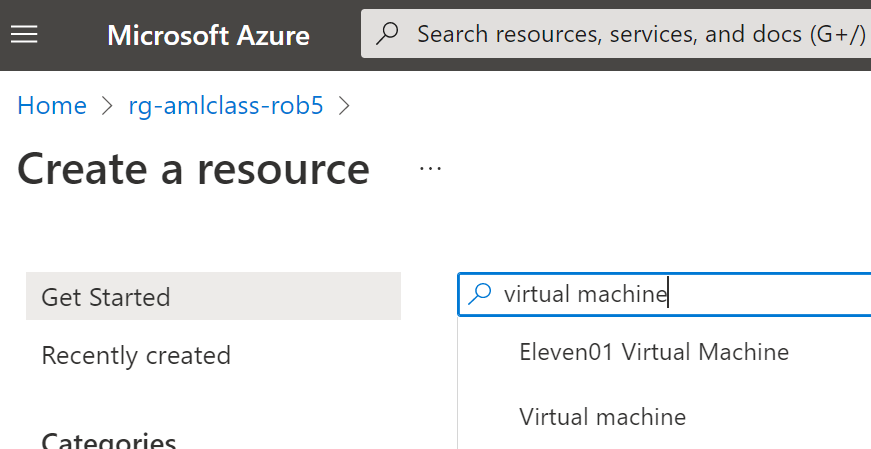

# MSE544 Creating a VM and a machine image on the Azure cloud

[TOC](#table-of-contents)


[Jump to hands-on activity](#start-a-vm-on-azure)


## Table of contents

- [Overview](#overview)
    - [Jupyter](#jupyter-notebook-servers)
    - [Python environments](#python-environments)
    - [Object and block storage on the cloud](#object-and-block-storage-on-the-cloud)
    - [git and GitHub](#git-and-github)
    - [The Plan](#the-plan)
- [Start a VM on Azure](#start-a-vm-on-azure)
- [Log in to the VM](#log-in-to-the-vm)
- [Create a machine image in the Azure portal](#create-a-machine-image-in-the-azure-portal)


## Overview


[TOC](#table-of-contents)


Virtual Machines (VMs) are self-contained computers; also called ***instances***. On the cloud 
an ***instance type*** means a VM with a set of specifications: How much CPU power, memory, storage, and 
networking speed. Based on these specs we pay at some rate for a VM 'per hour' until we **Stop** it.


A VM is distinct from a ***container***: A container makes use of a computer's underlying operating system; 
so it starts much faster. It is more of a (substantial) program running on a computer. 


A VM is of course also distinct from a serverless function, which is a managed service. The VM is 
provided to us provisioned with an operating system where we are the root user; 
so this is far from the notion of 'managed'. 


A single physical computer may host more than one Virtual Machine.  


On the cloud we select a VM by choosing both an ***instance type*** and an ***operating system***. The type
matches the computer's purpose to processing power, memory, network speed and other features. A bigger
VM costs more per hour on the cloud, be it Azure or AWS or GCP or some other platform.


Technical detail: The operating system *actually* selects a pre-built *image* which includes
that operating system. So the term *image* used here is the same idea of the *image* we are
working towards creating later on. The image we begin with (select) is loaded into the VM as a 
*blank slate*: Just the operating system, an empty user directory, no additional content. 
We log in to this generic VM as a generic user and continue to customize it from there.


The VM we use costs $0.10 per hour or $12 per day. A good rule of thumb is: Establish a 
VM to shut off every evening when you create it. This (passively) ensures we won't leave
it running all night. "Stop the VM when it is not in use." This can be done actively as
well, for example through the Azure portal. 

Note: **Starting** and **Stopping** a VM
are distinct from **Terminating** it. Terminate / Delete a VM and it evaporates; it is gone forever. 


### Jupyter Notebook servers


[TOC](#table-of-contents)


Since we are working with a VM, lets customize it as a research
computing platform by installing a Jupyter notebook server. This is a research tool in common use
(circa 2022) that is popular for a variety of reasons. For one, Jupyter notebooks enable us to develop 
and run code in small blocks called cells, in contrast to the traditional 'write large monolithic programs' 
that can be challenging to debug. Another valuable feature of Jupyter notebooks is support for documentation 
interspersed with code. This breaks down the barrier between code and write-up, between 
analysis and publication. 


Jupyter notebook code execution is managed by a language-specific program 
called a kernel (for example 'Python kernel', 'R kernel', 'Julia kernel'.  
The kernel operates "behind the scenes" to maintain the notebook environment and
run blocks of code as requested. In our case we will use Python, 
where the two other primary Jupyter-supported languages are Julia and R 
(hence 'JuPyt(e)R'). In the spirit of expansibility many other kernels have
been developed as well: There are
more than 100 Jupyter kernels available at this time. 


### Python environments


[TOC](#table-of-contents)


Python features a level of virtualization (specialization) via *virtual environments*. 
The Python *base* environment is the Python interpreter and libraries that comprise the
basic Python installation in the operating system. This base environment is a distinct 
concept from the Jupyter notebook server. From this base or default environment a Python 
virtual environment is often built to further customize the workspace. A virtual environment 
is an isolated space in which additional libraries are installed. In Visual Studio Code
(VSCode) a virtual environment called **`.venv`** was created in relation to building
Azure Functions. This resulted in the string `(.venv)` pre-pended to the Console prompt. 


### Object and block storage on the cloud


[TOC](#table-of-contents)


* Block storage equates to disk drives: A root drive and optional additional drives, attached to a VM
    * Fast access, capacity costs $0.10 per GB per month
* Object storage (on Azure 'blob storage') is not attached to a VM
    * Like block storage: supports a directory structure for objects (files)
    * Cheaper by a factor of 4; has other features
    * Does not permit file scanning in place
        * Instead: Read a file of interest directly into memory or copy to block storage
    * Data archival also possible


### git and GitHub


[TOC](#table-of-contents)


GitHub is a provider of Internet hosting for software development and version control using **`git`**. 
**`git`** is in turn a Linux software version control utility. GitHub and similar hosting
sites facilitate open sharing of software, part of the larger picture of reproducible research.


* The **`git clone`** command can be used clone GitHub *repositories*,  
thematic collections of files in a directory tree. **`git`** comes with a learning curve.

* Improper use of GitHub can grant cloud access to Bad Actors. This in turn can lead to lost time and money.


### The Plan


[TOC](#table-of-contents)


* Three modes of compute on the cloud: **Serverless Functions**, **Containers** and **VMs/Images** 
* VMs are used like traditional servers. Images are freeze-dried 'zip file' versions of VMs.


"As if we need a research computing environment" the sequence of events in this hands-on:


- Start a VM on the Azure cloud in your Resource Group (obtain its ip address and a key file)
- Log in to this VM from VSCode
- On the VM
    - Install the Jupyter Notebook server in a dedicated environment
    - Install some related data science libraries such as `pandas`
    - Create a research environment by cloning a GitHub repository
    - Start a jupyter notebook session with no visible interface
- On your computer
    - Create an SSH tunnel from your computer to the VM
    - Enter a local Jupyter connection address
        - By virtue of the SSH tunnel it will connect to the Jupyter Notebook server
    - Verify everything works
- From the Azure portal: From your VM create an Azure *image*
- From this image: Start a new VM and verify it is identical to the one you have customized


- *Stretch task: Place some data in object storage on Azure and access that from your VM


## 1 Start a VM on Azure


[TOC](#table-of-contents)


* On a browser sign in to the [Azure portal](portal.azure.com) and verify your Subscription
    * Be sure to work in the Central US Azure region
    * Select or create an appropriate *Resource Group*
        * A Resource Group (abbreviated RG) is a logical/virtual container for associated Azure resources
        * A Resource Group might contain a Virtual Machine (VM), a monitoring service and a Storage Account
* Below is a portal screencapture showing a Resource Group list: Just one Resource Group is present
    * This Resource Group will contain our Virtual Machine and associated resources: That's the goal.

<BR><BR>

<BR>

* From the Resource Group overview click `+Create` (The image below shows `+Add`: Same thing.)
   * Select 'Virtual machine' (directly: click the icon; or use the search bar)
 
> We can use the Azure **Marketplace** to browse VM images by operating 
system and based on other features. As a stretch activity you can spend some time
looking around at what is available.

<BR><BR>

<BR>


* Use the VM wizard to customize the VM; use defaults but note the following:
   * Name the VM something like `YourNetIDvm`
   * Region = (US) Central US
   * Image = Ubuntu Server 20.04 LTS - Gen 2 (or more recent)
   * Size = Standard_D2as_v5 - 2 vcpus, 8 GB memory
   * Ensure Public inbound ports = Allow selected ports
   * Ensure Select inbound ports = SSH (22)

   
<BR><BR>

<BR>
<BR><BR>

<BR>


* Next: Disks > (defaults) > Next: Networking > (defaults)  > Next: Management

<BR><BR>

<BR>

   
Above: The defaults of the Networking tab ensure we can connect to the VM using SSH.

   
* Management tab
   * Enable auto-shutdown
       * Keep the shutdown time as 7PM
       * Change the Time zone to Pacific Time

<BR><BR>

<BR>

* Next: Advanced > (defaults) > Next: Tags   
   
* **Tags** tab
    * Include some tags to inform your future self what this VM is for

<BR><BR>

<BR>

* **Next: Review and Create** tab: Review the description
    * This VM will cost about $0.10 per hour
    * Click **Create**
        * This will prompt you to download a key file: Do so to a safe location on your computer

<BR><BR>

<BR>

   
* Once the create action is complete: Click 'Go to resource'
    * Note down the ip address of the VM   
   
<BR><BR>

<BR>
   
   
* At the top of the central / main window notice there is a sequence of utility buttons
    * These are Connect, Start, Restart, Stop, Capture, Delete and Refresh

<BR><BR>

<BR>

   
* From the (default) Overview: Notice that the VM has a tabbed sequence of information pages
    * These are Properties, Monitoring, Capabilities, Recommendations and Tutorials
    * This system of tabbed sub-pages makes a lot of information available

<BR><BR>

<BR>

   
* On the left menu bar under Settings click on Disks
    * Note that the VM has an operating system disk with a 30 GiB capacity
    * Some of this will be used by the operating system
* Left menu bar: Scroll down to Automation, temporarily click **Export template**
    * ...content enables us to build this VM from code (rather than click-and-type)
* Left menu bar: Scroll up to Settings, click **Connect**
    * Four-step recipe for logging in to this VM; this is just for reference, for future use
* Now it is time to log in to this VM: Instructions below

   
## Log in to the VM
   

[TOC](#table-of-contents)

   
* Open Visual Studio Code and activate **`ssh`** in the Terminal window (ctrl/cmd + `)
* In the terminal verify the `ssh` command exists: It produces a usage message
* Go to the home directory using `cd ~`
* Move the `.pem` file downloaded during the VM Create to this directory
    * For example `mv /mnt/c/Users/myusername/Downloads/rob5vm_key.pem .`
* Change the permissions of this file to be "user read only" using the somewhat cryptic `chmod` command
    * `chmod 400 rob5vm_key.pem`
* Type in or paste in the `ssh` connection command
    * You can copy this command to your clipboard from the Azure portal **Connect** page identified above
    * Make sure to use the correct path to the `.pem` file
    * Make sure to keep the username `azureuser`
    * Make sure to copy the provided ip address. Below I use `27.173.147.19`
   
```
myLocalComputer$ ssh -i ./rob5vm_key.pem azureuser@21.173.147.19
   .
   .
   .
(confirm ok with 'yes')
   .
   .
   .
azureuser@myVMname:~$ ls -al
```

* During the connection we see "The authenticity of host ... can't be established. Are you sure?"
    * Enter 'yes'
    * You should now see a welcome message and a `bash` prompt
        * We used `ssh` to connect but once logged in we are running the `bash` shell
        * To verify this type in `ps -p $$`
    * Examine the operating system disk with `df`
        * This shows a 30GiB root drive, 7% in use; so 28GiB available

   
### Make sure Python is installed on the VM
   
   
* Once logged in: See if `python3` is installed
    * It should indicate Python 3.8.10 and provide you with the Python interpreter prompt `>>>`
    * Stretch activity: From your VM run an Azure Function
        * ...if yours from the previous week is running you can use that
        * ...if not you may use `https://rob5azfn02.azurewebsites.net/api/HttpTrigger1`
        * See code snippet below
        * An Azure Virtual Machine calls an Azure Function: Composition of cloud services
    * Use ctrl-d to exit the Python interpreter


Python to run a Serverless Function:

   

```
>>> import requests
>>> urlbase = 'https://function_name.azurewebsites.net/api/HttpTriggerName?'
>>> print(requests.get(urlbase + 'n=1234').text)
```

   
## Create a machine image in the Azure portal

   
[TOC](#table-of-contents)


   
* Select the VM in the Azure Portal and click **Capture**
* 'Create an image' wizard
    * Share image to Azure compute gallery: Select **No, capture only a managed image**
    * Next: Tags >
        * Add a Delete After tag: As before tags are intended to inform a future person
    * Next: Review + Create > Create
        * Typically takes a couple of minutes > 'Deployment in progress' > Go to resource
        * The resulting VM image can be restarted on small low-cost machines or large high-cost machines
        * It can be shared with colleagues or made publicly available


   
   
# left off here
   

### Install the Jupyter Notebook server on the VM
   

* Is the Jupyter Notebook server installed? Enter `jupyter` to find out that it is not
    * This sets us off on the path of customizing the VM
    * One approach to how to do this: search on 'how to install jupyter on ubuntu'
        * This turns up a number of instructive websites including
[this one](https://www.digitalocean.com/community/tutorials/how-to-set-up-jupyter-notebook-with-python-3-on-ubuntu-18-04).
        * The commands are copied in sequence below


Enter the following commands in sequence. Some steps require confirmation so it is
best to run each command to completion before entering the next. Emphasis: These are commands you are
entering on your VM bash command prompt `azureuser@myVMname:~$ `, ***not*** on your local computer. 

   
```
azureuser@myVMname:~$ sudo apt update
azureuser@myVMname:~$ sudo apt upgrade
azureuser@myVMname:~$ sudo apt install python3-pip python3-dev
azureuser@myVMname:~$ sudo -H pip3 install --upgrade pip
azureuser@myVMname:~$ sudo -H pip3 install virtualenv
azureuser@myVMname:~$ virtualenv my_project_env
```

   
Activate the virtual environment **`my_project_env`**; which changes the prompt.
Run this command after logging back in to this VM: Ensure the prompt begins
with `(my_project_env)`.

   
```
azureuser@myVMname:~$ source my_project_env/bin/activate
```

Install the Jupyter notebook server and some Python data science libraries.
   
```
(my_project_env) azureuser@myVMname:~$ pip install jupyter
(my_project_env) azureuser@myVMname:~$ pip install matplotlib
(my_project_env) azureuser@myVMname:~$ pip install numpy
(my_project_env) azureuser@myVMname:~$ pip install xarray
(my_project_env) azureuser@myVMname:~$ pip install netcdf4
```
   

> To reiterate: Always begin a session on this VM by activating the environment *my_project_env* 
by running `source my_project_env/activate`. This is necessary because `jupyter` is installed
only in this environment; not in the login or base environment. 
   

Test the installation by typing `jupyter` again. The VM should now recognize and run this command.


### Clone an oceanography repository
   
We have reached a point where it would be nice to have some code and data to work with. 
We can clone some open source content from the GitHub software control website.
   
```
(my_project_env) azureuser@myVMname:~$ cd ~
(my_project_env) azureuser@myVMname:~$ git clone https://github.com/robfatland/ocean
```
   
This should complete in under a minute. You can use `ls` to show there is a new directory called `ocean`. 
It contains data and an IPython notebook called `BioOptics.ipynb`.


### Start the Jupyter Notebook server
   

The Jupyter Notebook server interface exists in a browser window. 
However, at this time our VM is not connected in any manner to a local browser.
The only connection we have is a bash shell (text window) enabled via an `ssh` connection. 
The trick here is to use this secure `ssh` connection from your host machine to the Azure VM.
 
   
On the VM command line issue this command. The prompt is included as a reminder that 
you must have the `my_project_env` environment activated as described above.
  
   
```
(my_project_env) azureuser@myVMname:~$ (jupyter notebook --no-browser --port=8889) &
```
   
   
The trailing ampersand runs the command as a background job. 
This will produce output something like: 
   
   
```
[1] 1581
(my_project_env) azureuser@rob5vm:~$ [I 18:04:32.793 NotebookApp] Serving notebooks from local directory: /home/azureuser
[I 18:04:32.793 NotebookApp] Jupyter Notebook 6.4.11 is running at:
[I 18:04:32.793 NotebookApp] http://localhost:8889/?token=ab39283485838005ef2e564689f62e7150acdef483cfe751
[I 18:04:32.793 NotebookApp]  or http://127.0.0.1:8889/?token=ab39283485838005ef2e564689f62e7150acdef483cfe751
[I 18:04:32.793 NotebookApp] Use Control-C to stop this server and shut down all kernels (twice to skip confirmation).
[C 18:04:32.798 NotebookApp]

    To access the notebook, open this file in a browser:
        file:///home/azureuser/.local/share/jupyter/runtime/nbserver-1581-open.html
    Or copy and paste one of these URLs:
        http://localhost:8889/?token=ab39283485838005ef2e564689f62e7150acdef483cfe751
     or http://127.0.0.1:8889/?token=ab39283485838005ef2e564689f62e7150acdef483cfe751
```

   
The Jupyter notebook server will "listen" on port 8889 for interactive information.
Until that shows up: It waits patiently.
   

### Create an `SSH` tunnel from your computer to the VM
   
   
On your computer use the `ssh` command to create a tunnel to the VM.
Specifically this connects port 8890 on your computer to port 8889 on the Azure VM.
Remember to use the correct ip address for your VM.
   

```
ssh -N -f -i ./rob5vm_key.pem -L localhost:8890:localhost:8889 azureuser@31.92.184.12
```
   
   
This will direct local traffic to port 8890 to the Azure VM's port 8889. That port connects to
the Jupyter Notebook server. 
   
   
The final step is to enter a modified version of the VM Jupyter 
URL ***into your browser address bar***. This is the URL that printed when you started the Jupyter
Notebook server above. It includes a long token string for authentication. It also includes
port number 8889; but this must be modified to 8890, your local SSH tunnel port.
   
```
http://localhost:8890/?token=ab39283485838005ef2e564689f62e7150acdef483cfe751
```

Verify that the Jupyter Notebook server runs and provides you with access to the `ocean` repository contents. 
You can use the browser interface to move into the `ocean` folder and start the `BioOptics` notebook in a 
separate tab. Use the **Run** button at the top center of the BioOptics tab to execute a series of cells.

> The BioOptics Python cells run without error because the necessary libraries were installed above.

   

Stretch activity: Start a new VM from this image. Start as before with "Create a virtual machine".
This time for Image select "See all images" and then in the left menu select "My Images". This 
should show the image created above as a choice. Go through the setup wizard as before, click
Create, and download the new key file. Log in to the new VM with `ssh -i keyfile.pem azureuser@123.234.123.234`. 
   
Once you have logged in to the new VM, ensure jupyter is installed after activating the environment as before.
   
```
source my_project_env/bin/activate
jupyter
ls
```
   
This "closes the loop": We have created a data science VM on the Azure cloud, customized it, 
saved it as an image, reconstituted a second VM from that image, and demonstrated that the new VM
has all the previous VM's customization built in.


   
# Additional topics
   
   
## Re-starting a VM

   
If your earlier session was interrupted and/or your Virtual Machine was set to auto-halt
every day at 7PM: It may currently be Stopped. Restart it
in the Azure portal by selecting the VM and clicking the **Start** button.
Most likely this will assign your VM a new ip address; so note this down.
   

You can assign a static ip address to your VM (this is an Azure service) so it will
always have the same ip address whenever it is started up again. 
   

## Anaconda

   
Suppose we are interested in using a data science distribution of Python. Commonly used is
[***Anaconda***](https://anaconda.com). It installs with a large collection of data science 
libraries. 
   
   
Note: We are not doing this as part of the hands-on walk-through; Anaconda is just mentioned here
in passing. 
   
   
One method of installing Anaconda is to use the `wget` Linux command to copy the installation shell script
(file extension `.sh`) from the web to a local environment; and then use the `bash` command to run the 
script. It is worth checking the [Anaconda repository](https://repo.anaconda.com/archive/)
for a recent version; and the [Anaconda main website](https://anaconda.com) for other installation options. 
There is also a lightweight version of Anaconda called Miniconda that does not include so many features.
   

One Anaconda installation command sequence (Linux, circa 2022):
   

```
wget https://repo.anaconda.com/archive/Anaconda3-2021.11-Linux-x86_64.sh
bash Anaconda3-2020.11-Linux-x86_64.sh
```

