# Creating a VM image: Azure cloud

## Introduction

Virtual Machines (VMs) are computers. Technical detail: They are operating systems installed as hermetic
environments on computers; so there is a level of abstraction above the basic computer + operating system; 
and this is why we have the term *virtual* involved. A single physical computer may host more than one
Virtual Machine. 


On the cloud we select a VM by choosing both a ***type*** and an ***operating system***. The type
matches the computer's purpose to processing power, memory, network speed and other features. A bigger
VM costs more per hour on the cloud, be that cloud Azure or AWS or GCP or some other platform. 


The small VM we use here costs $0.12 per hour or about $14 per day; so this leads us to a first
rule: Stop the VM when it is not in use. This is like stopping a laptop: Everything persists but
it is no longer consuming electricity (incurring hourly charges). **Start** and **Stop** for a VM
are distinct from **Terminate**. When we terminate a VM it evaporates; it is gone. 


#### VM Concept and Plan including Jupyter Notebook servers


A Jupyter notebook server is a research tool in common use at this time. It is a popular component 
of the research ecosystem. We will include one of these in this construction process. 


A researcher installs and runs a Jupyter notebook server on a VM as a step in building
a research workspace. Commonly the programming language in use in these notebooks is 
Python. 


Python also features a level of virtualization in what are called *virtual environments*. 
The Python *base* environment is the Python interpreter and libraries that comprise the
basic Python installation. This base environment is a distinct concept from the Jupyter
notebook server. From this base or default environment a Python (virtual) environment 
is often built to further customize the workspace. A virtual environment is an isolated 
space in which additional libraries are installed.


To connect this together as a narrative we can say that we...

* ...choose a particular cloud (Azure) on which to build a research space
* ...identify and start up a Virtual Machine (VM) with an associated hourly cost
* ...log in to this VM using credentials we received in the start-up process
* ...install Python and a Jupyter Notebook server
* ...create a virtual Python environment and in that context install additional Python libraries
* ...import some test data to the VM file system from object storage (see below)
* ...import some test code to the VM file system from GitHub (see below)
* ...execute Python code found in *cells* of the Jupyter notebooks


#### Object storage versus block storage

A "disk drive" or "storage drive" is a fairly large block of read/write memory associated directly with 
a file system on a computer. On a cloud VM this is known as block storage and it includes two sub-types. 
First there is the root file system that includes the VM operating system, in our case Ubuntu Linux. 
Second there can be additional attached block storage devices often called data drives. These will tend 
to feature larger storage capacity. 

The cloud also features a second type of storage called object storage. On Azure this is called *blob* 
storage. It emphasizes the idea that objects in object storage are not treated as files that can be 
opened and read through (indexed) in search of some particular segment of information. This is in contrast
to block storage. Object storage or blob storage does support reasonably high connectivity speed; so
it can be helpful to think of it as an extension of the computing environment with the following features:

- object storage is by design virtually infinite in capacity
- object storage is cheaper per byte per month than block storage
- object storage features fast connection speed but not as fast as block storage attached to a VM
- object storage allows us to read an object (say a file) directly into computer memory
- object storage allows us to copy an object (say a file) to block storage
- object storage does not allow us to "open and access" the contents of an object (say a file)
- object storage blobs can be files, collections of files, entire folder trees, entire block storage file systems, or entire VMs

In terms of cloud computing design patterns: Object storage is a cost-effective way of storing data that 
does not need to be accessed immediately; but does have some future intended use. 


#### GitHub


GitHub is a provider of Internet hosting for software development and version control using **`git`**. 
(source: Wikipedia) **`git`** is in turn a Linux software version control utility. GitHub and similar hosting
sites are in common use as a means of sharing software solutions particular to open and reproducible research.
There are in consequence two important aspects of GitHub use relevant to use of public clouds like Azure. 


1. It is common practice to use the **`git`** command to clone GitHub *repositories*, which are 
thematic collections of files contained in a directory structure. However there are a number of
details in learning to use **`git`** effectively: This means there is a proper and necessary 
**`git`** learning curve.


2. Improper use of GitHub can result in cloud access keys landing in an open repository. There are malevolent 
code bots in operation on GitHub that will use such inadvertently open keys to mine bitcoin on cloud VMs. This
costs actual money that is charged to the cloud User. Typical spend rates for this scenario are USD 15,000 per 
hour; so it is important to avoid committing access keys to GitHub repositories.


#### Plan


"As if we are doing some research" the sequence of events in this walk-through are:


- Start a VM on the Azure cloud
- Install the Anaconda data science platform (Python with Jupyter notebook server support)
- Install some additional Python libraries
- Download some data
- Download a Jupyter notebook repository
- Make sure everything works properly
- Save the results as an Azure VM **image**
- Shut down ("terminate") the VM
- Start a completely new VM from the stored image
- Again test that everything works properly


Note: There is a distinction between a virtualized computer or virtual machine (VM) and an actual physical 
computer. While this is outside the scope of this material it can be relevant within the general topic of 
compute optimization.


## Background perspective


There are three degrees of complexity in building a compute resource on the cloud. Actually there are
more than this but let's start with three: **Functions**, **Containers** and **Images**. Functions are simplest
but they have a limited degree of power and flexibility. Images are the most complicated; they correspond
to Virtual Machines. In fact Images are like a freeze-dried (or if you like 'zip file') version of a VM.
Containers occupy a middle ground between Functions and Images. We are visiting all three with the idea 
of seeing a spectrum of options for doing data science on the cloud. 


## Walk-through

This procedural walks you through creating a working Virtual Machine with a Jupyter notebook server, testing it, 
and storing it as an Azure machine image. That last step is a single click task; the bulk of the effort is 
the preparation. This walk-through uses the [Azure portal](portal.azure.com), a browser-based interface to
the services available on the Azure cloud. 


* Using a browser sign in to the [Azure portal](portal.azure.com) and identify/select an Azure *Resource Group*
    * A Resource Group (abbreviated RG) is a logical/virtual container for associated Azure resources
    * As an example an RG might contain a Virtual Machine (VM), a monitoring service and a Storage Account
    * RGs are associated with regions; and should be created in a region near to your geographic location
    * If you do not have an RG available you can use the Azure portal to **Create** a new one
* Below is a portal screencapture showing a Resource Group list: Just one Resource Group is present
    * This RG will contain a Virtual Machine and associated resources: That's the goal.

<BR><BR>

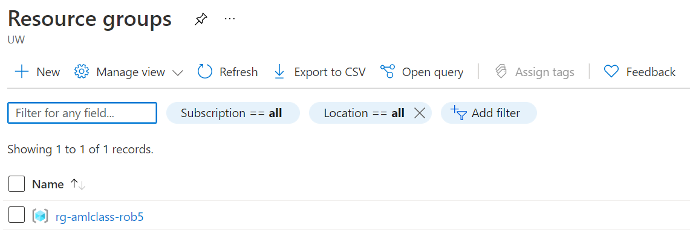


<BR><BR>

* Select the RG and click the `+Add v`
    * This is so we can add a Virtual Machine to the RG


<BR><BR>


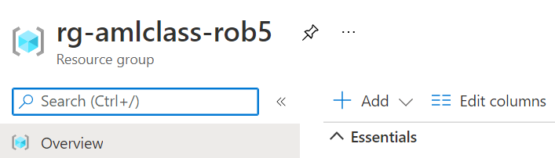

<BR><BR>

* The `+Add v` gives us a drop-down. Select `Marketplace`. 
    * This is where we can get Ubuntu Linux VM images at no cost.

<BR><BR>

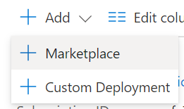

<BR><BR>

* Select from the Marketplace an Ubuntu Server image. 
    * Notice that an *image* is what we set out to build... and here is one already built for us so that was easy 
        * We select an "empty" image that includes nothing more than the Ubuntu operating system
        * Once the Virtual Machine running Ubuntu Linux is running we customize it

<BR><BR>

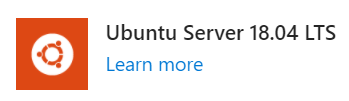

<BR><BR>

* Click `Create`
    * This means "Initiate the process of starting a VM using this Ubuntu operating system"

<BR><BR>

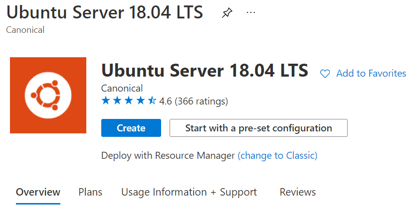

<BR><BR>

* This brings us to a multi-step VM builder wizard. 
    * We will work through the multiple tabs fairly quickly, mostly using default values
    * On the first tab: Enter a machine name and choose the small default Size from the dropdown. 
        * Notice that the monthly cost of each VM choice is shown
        * The remaining entries in the first wizard tab: Defaults are fine

<BR><BR>

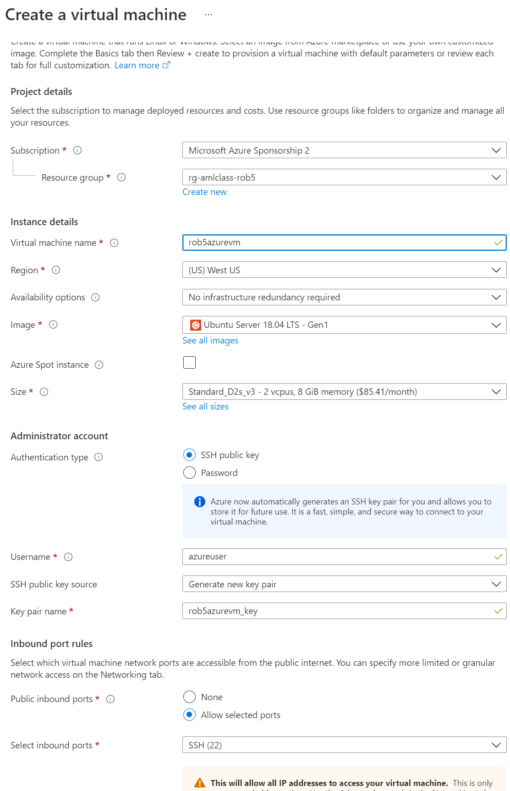

<BR><BR>

* Click **Next** to arrive at the **Disks** tab of the VM wizard. 
* Add a 256GB disk to create some data capacity on this VM.

<BR><BR>

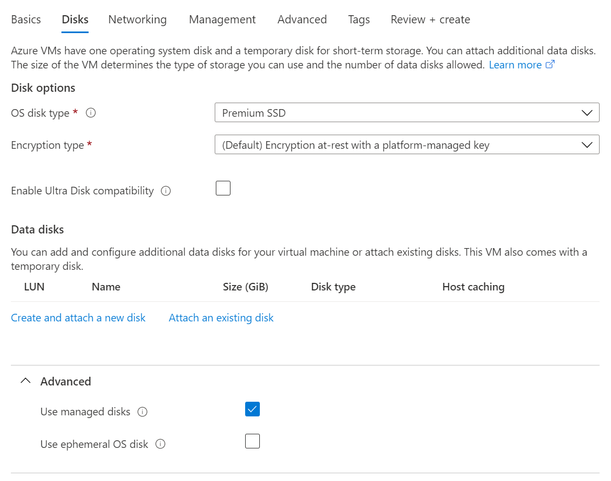

<BR><BR>

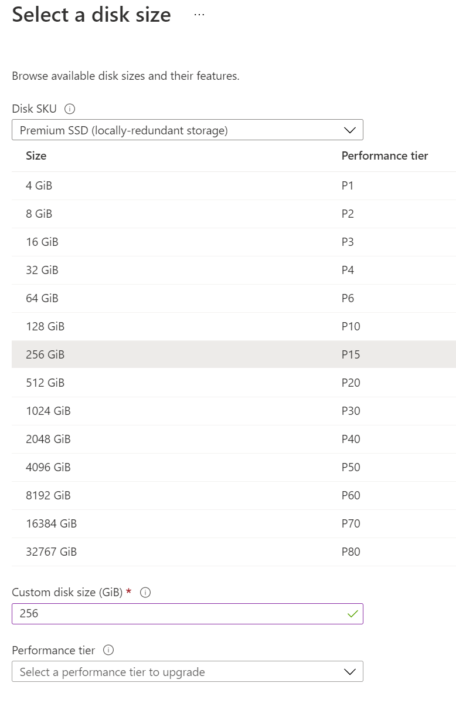

<BR><BR>

* Once disk volume is selected you can (**Ok**) confirm you want to **Create a new disk**.

<BR><BR>

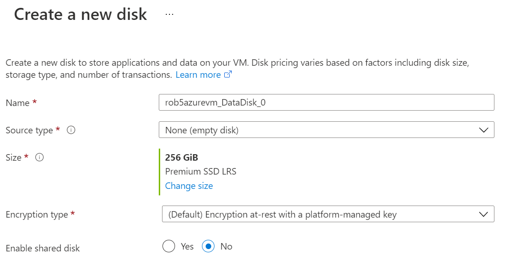

<BR><BR>


* Next are *Networking*, *Management* and *Advanced* tabs: Keep defaults 

<BR><BR>

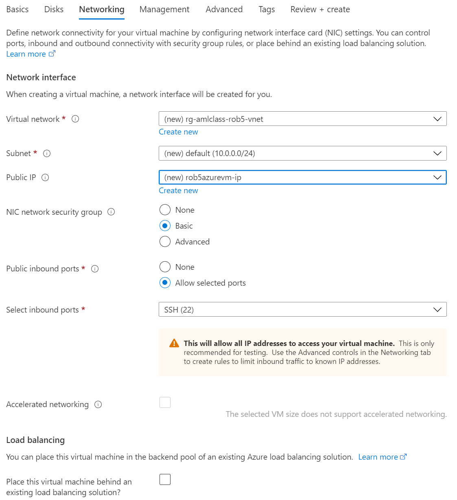

<BR><BR>


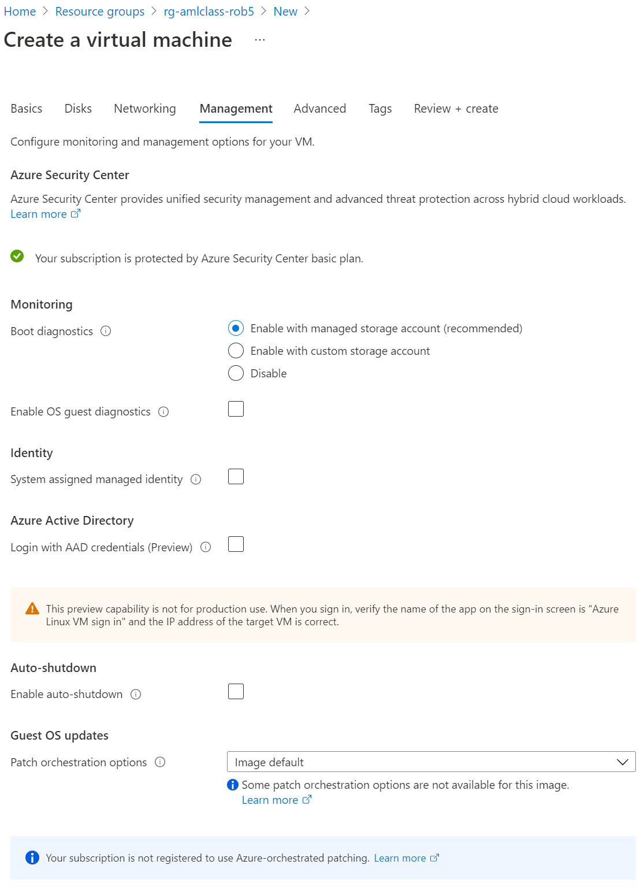

<BR><BR>

* **Tags** tab: Include some tags so that an account administrator knows what these resources are for.

<BR><BR>


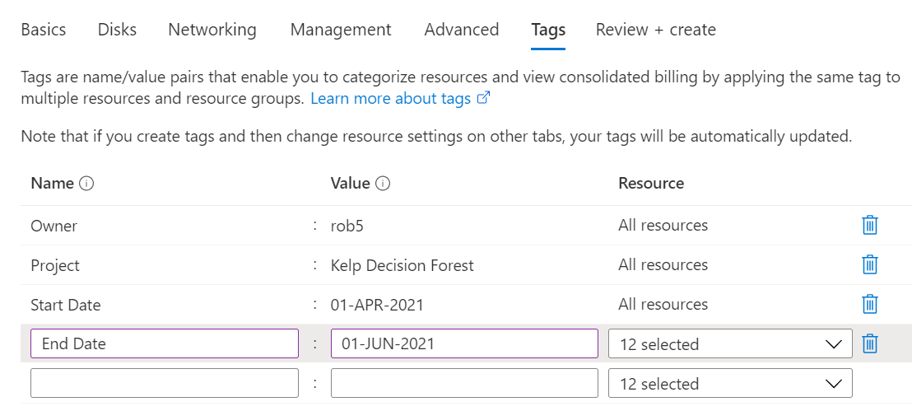

<BR><BR>

* At the **Review and Create** tab we get a sense of what will be built
    *  It will cost 12 cents per hour to operate 


<BR><BR>
   

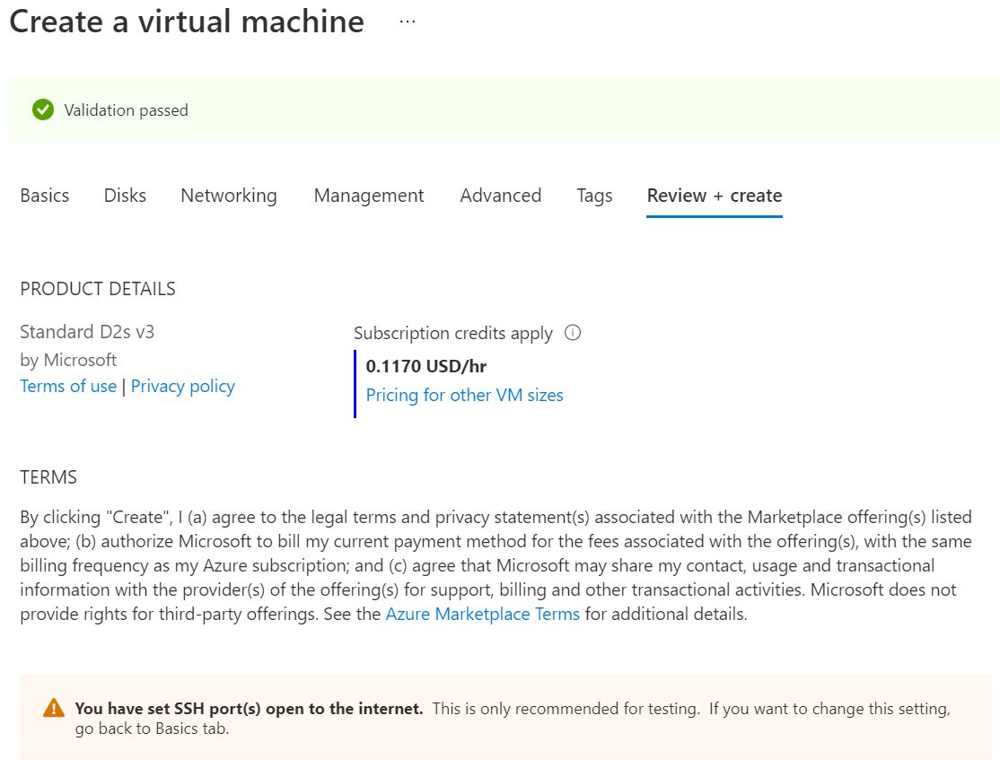

<BR><BR>
   
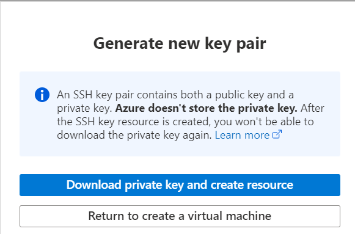

<BR><BR>

* The pop-up dialog shown above gives us authentication options
    * Download an SSH key pair file to ensure you will be able to access the VM 
    * We use this rather than using username + password
    * Place the keypair file in a secure location on your local computer
        * Ensure that it will not accidentally end up copied to GitHub
    * We will refer to this file as `fu.pem`
    * Change the read-write-execute permissions of `fu.pem` to `r--------` or `0400` in octal
        * The Linux command for this is `chmod 400 fu.pem`


***For Windows users:*** You can use `fu.pem` from a local installation of the **bash** shell.
Installing an Ubuntu bash shell is in the spirit of the 
target Ubuntu operating system; and this in turn works well with Anaconda and Jupyter notebook servers.
However: If you prefer to use the popular Windows PuTTY free SSH client: Be prepared 
to do a bit of learning as you may need to modify the `.pem` file into a `.ppk` file. 
  

***For all users:*** As noted above you must change the permissions of the `.pem` file to `r--------`.
This means that only the user can read the file, a restrictive step that increases the
security of your access path to the Virtual Machine. 


<BR><BR>


* Here is the "Deployment complete" message you should see once the VM has been launched:


<BR><BR>


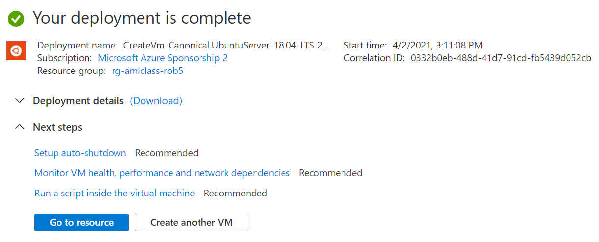


<BR><BR>


* We then see a lot of the details of operation of this newly-created VM:


<BR><BR>


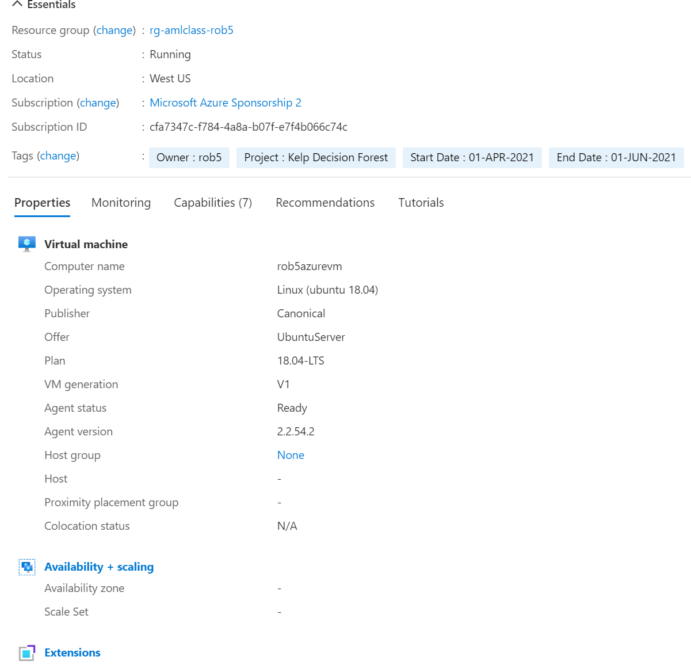

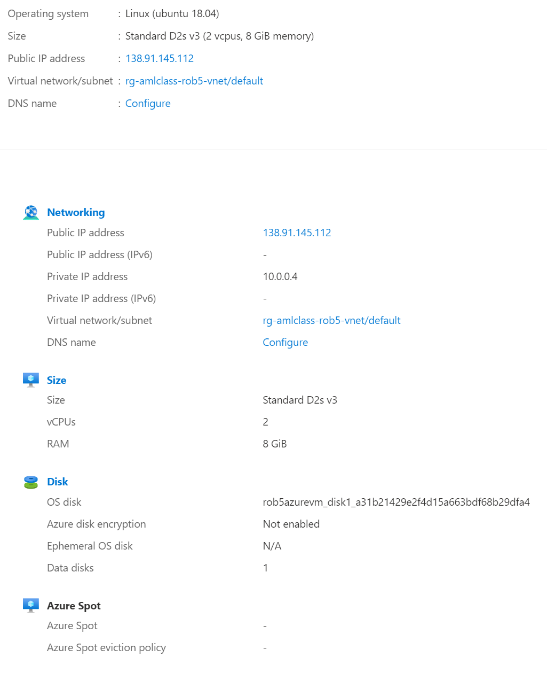


<BR><BR>

* In the above VM description notice there is nothing present under **Azure Spot**
    * **Azure Spot** is an option you can choose that significantly reduces the cost of the VM
    * The catch is that there is a small chance you may be evicted from the VM
    * Read about "cloud spot markets" to learn more


* Note the above information includes an ip address for this VM. 
    * In the example above the ip address is `138.91.145.112`
    * For simplicity let's say the ip address is `111.22.33.44`
    * Reminder: We also suppose you have named your `.pem` SSH keypair file to be `fu.pem`  
    * Your ssh login command from your local Linux prompt is then:


```
ssh -i fu.pem azureuser@111.22.33.44
```


* Confirm the login with 'yes'. You should now have a tell-tale prompt:
    * `azureuser@machimename:~$ `
        * The primary cause of this step not working is the `0400` permission for the `.pem` file was not set (see above).


* The next step is to mount the 256GB data disk we added during the VM creation process 
    * This was not done automatically
    * The command to get started is `lsblk -o NAME,HCTL,SIZE,MOUNTPOINT`
    * Notice that the 256 GB disk is listed as `sdc` but it has no mount point as yet


<BR><BR>


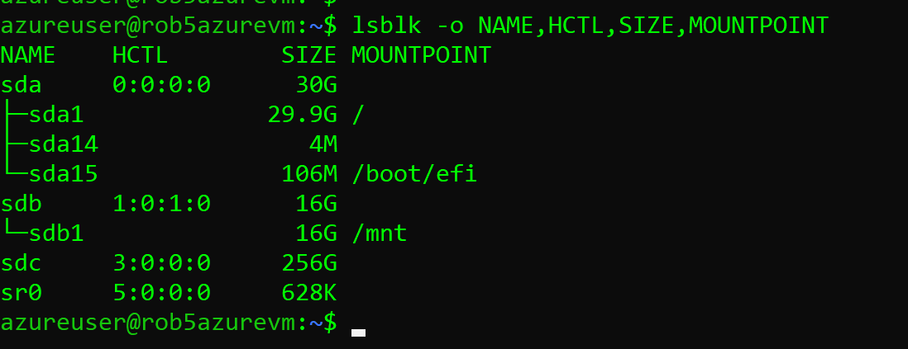


Noting this is green text on a black background: If you are interested in 
retro-customizing the **bash** console: [Here is a link](https://robfatland.github.io/greenandblack/). 


<BR><BR>


* Follow directions for mounting a disk on an Azure VM
    * [How-to documentation](https://docs.microsoft.com/en-us/azure/virtual-machines/linux/attach-disk-portal)
    * Based on this the following commands were used to mount the data disk (notice 

```
sudo parted /dev/sdc --script mklabel gpt mkpart xfspart xfs 0% 100%
sudo mkfs.xfs /dev/sc1
sudo partprobe /dev/sdc1
sudo mkdir /datadrive
sudo mount /dev/sdc1 /datadrive
sudo blkid
```

* You can verify the mount by re-running `lsblk`: A mount point should be present now.
* Change directories to the data disk and ensure you can edit, save and modify a test file.
    * You may need to `sudo chmod` the `/datadrive` to make it read/write-able.
* Note the documentation on all of this provides links to additional documentation.

<BR><BR>
   
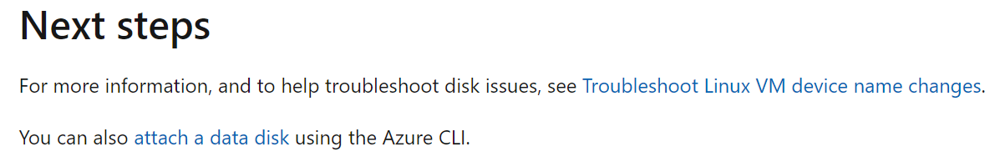 <BR><BR>
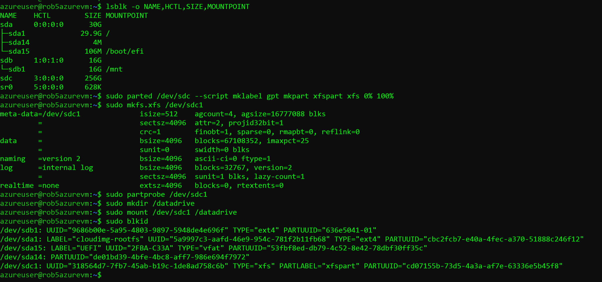
   

<BR><BR>

* At this point we begin customizing the Virtual Machine
* First we install the Anaconda Python package

```
wget https://repo.anaconda.com/archive/Anaconda3-2020.11-Linux-x86_64.sh
bash Anaconda3-2020.11-Linux-x86_64.sh
```

* This gets the Anaconda installation file using the `wget` command; then installs it using `bash`
    * The correct Anaconda installation filename can be found by searching 'install Anaconda'
        * Be sure to get the installation file for Linux, x86 and 64-bit
        * You can also opt to install a lighter-weight version called Miniconda 

<BR><BR>

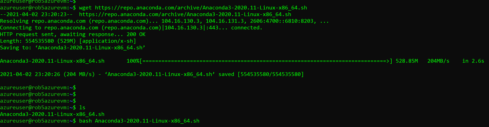

<BR><BR>

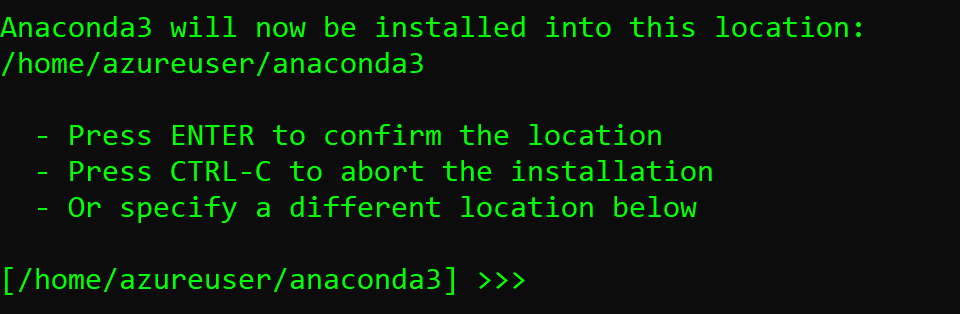

<BR><BR>
   
* You may need to log out of and then back in to your VM.

<BR><BR>

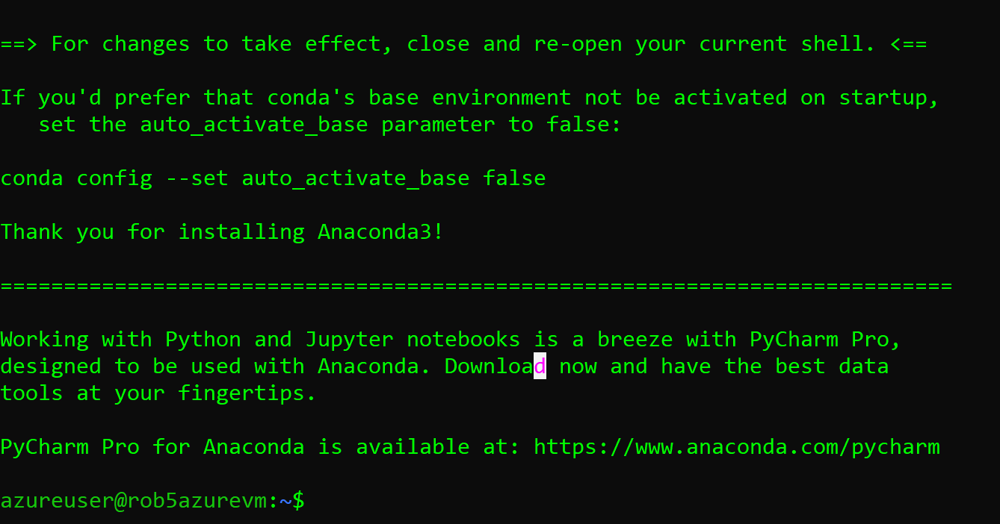

<BR><BR>

* At this point the Jupyter notebook server should be available for use. 
    * We proceed in two steps here
        * Get some test notebooks
            * From your home directory on the VM: run `git clone https://github.com/robfatland/chlorophyll`
        * Configure a Jupyter notebook server to run in `--no-browser` mode
            * On your Azure VM bash command line run `(jupyter lab --no-browser --port=8889) &`
                * This will provide a long token string, like this: `...token=ae948dc6923848982349fbc48a2938d4958f23409eea427`
                    * Copy this token string
            * On your local computer/laptop bash command line run this command:
                * `ssh -N -f -i fu.pem -L localhost:7005:localhost:8889 azureuser@111.22.33.44`
                    * Make appropriate substitutions for your `.pem` filename and your VM ip address  
            * On your local computer in a browser address window enter `localhost:7005`
                * When prompted enter the token string you copied above
            * On success: The Jupyter notebook server will appear in your browser
                * You should be able to navigate to the `chlorophyll` repository and see and run notebooks 
   
   
<BR><BR>


<BR><BR>

* Finally the last step, as noted, is quite simple: Create an image of this customized VM image
    * Select the VM in the portal and click **Capture**

<BR><BR>


<BR><BR>

* The "make image" wizard comes up.
* On the side dialog select No, capture only a managed image

<BR><BR>


<BR><BR>
   
* The VM stops and the image creation process starts up. 
* Shortly thereafter (minutes) we have an image of the VM available. 
    * This VM image can be restarted on small low-cost machines or large high-cost machines
    * It can be shared with colleagues or made publicly available
    * The image is static. If you make changes to the VM you must re-Capture the image to keep it up to date if you so desire


<BR><BR>


## Concluding remarks


The emphasis of this procedural is on the relationship between the running Virtual Machine 
(which took the bulk of the effort; and which costs a certain amount per hour of operation) 
and the ***VM Image*** created in the final step. First: The *VM Image* acts as a safe backup 
copy of the VM. 


* It can be easy to "forget about" the VM. It can left running without being in use. This might cost 
$0.20 per hour; or if it is a powerful machine maybe $1.20 per hour. This is arguably not good for the 
project budget. However the VM can be stopped, for example through the portal interface. When a VM is 
stopped it costs much less per day. And it can be re-started in a matter of a few minutes. The VM can 
also be connected to a cloud service that stops it every day at say 7 PM. This is a failsafe cost 
management technique. Stopping an already-stopped machine has no effect.


* We access VMs as shown here over the internet using the `fu.pem` keypair file. This file
should be kept in a secure location away from GitHub respository directories. It is sometimes 
possible to accidentally delete files so a backup copy of a keypair file stored in another 
secure location might come in handy. Azure has a security service for managing access keys called 
**Key Vault**; worth knowing about but beyond the scope of this tutorial.


* In this walk-through we created a 256GB data disk that was mounted as a file system on the VM. 
There is a cost associated with drives like this when they are left running. This drive for example
runs about $30 / month. There are lower-cost options as well. Attached storage 
devices can be frozen as disk snapshots, again reducing cost. 


* A running Virtual Machine has an ip address as we saw. This ip address will change
each time the VM is restarted, either from a stopped state or from a VM Image. It is 
possible to associate a "permanent" ip address with a VM to avoid having to keep adjusting 
the ip address each time the VM is re-started. On Azure these are called Static Public IPs
whereas on AWS they are called Elastic IPs. 

