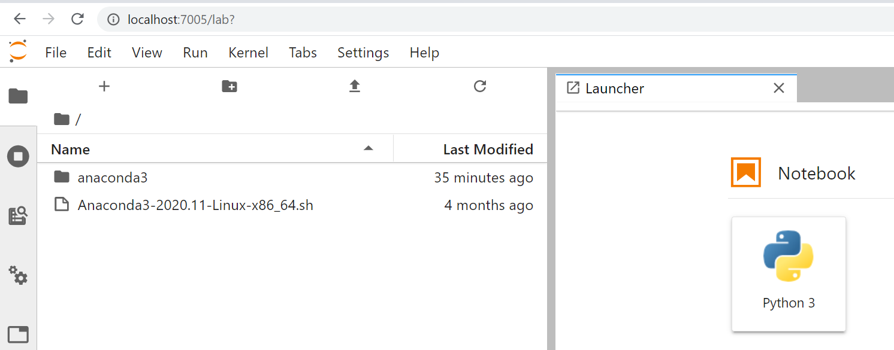
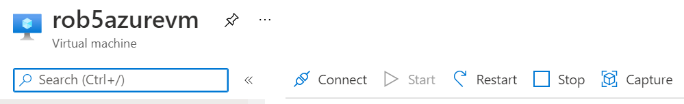
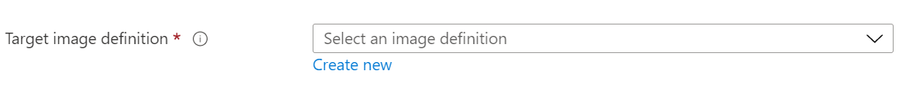
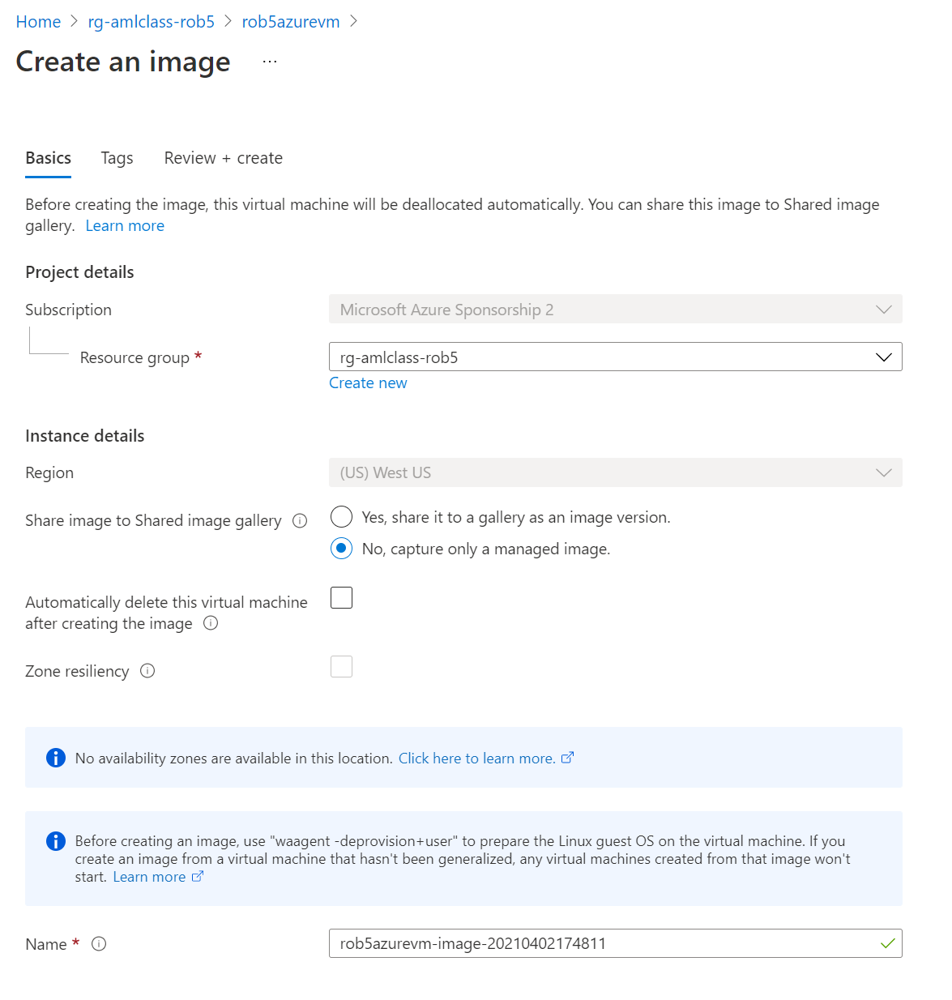

# Creating a VM image: Azure cloud

## Introduction


Virtual Machines (VMs) are self-contained computers; also called ***instances***. On the cloud 
an ***instance type*** means a VM with a set of specifications: How much CPU power, memory, storage, and 
networking speed. Based on these specs we pay at some rate for a VM 'per hour' until we **Stop** it.


A VM is distinct from a ***container***: A container makes use of a computer's underlying operating system; 
so it starts much faster. It is more of a (substantial) program running on a computer. 


A VM is of course also distinct from a serverless function, which is a managed service. The VM is 
provided to us provisioned with an operating system where we are the root user; 
so this is far from the notion of 'managed'. 


A single physical computer may host more than one Virtual Machine.  


On the cloud we select a VM by choosing both an ***instance type*** and an ***operating system***. The type
matches the computer's purpose to processing power, memory, network speed and other features. A bigger
VM costs more per hour on the cloud, be it Azure or AWS or GCP or some other platform.


Technical detail: The operating system *actually* selects a pre-built *image* which includes
that operating system. So the term *image* used here is the same idea of the *image* we are
working towards creating later on. The image we begin with (select) is loaded into the VM as a 
*blank slate*: Just the operating system, an empty user directory, no additional content. 
We log in to this generic VM as a generic user and continue to customize it from there.


The VM we use costs $0.10 per hour or $12 per day. A good rule of thumb is: Establish a 
VM to shut off every evening when you create it. This (passively) ensures we won't leave
it running all night. "Stop the VM when it is not in use." This can be done actively as
well, for example through the Azure portal. 

Note: **Starting** and **Stopping** a VM
are distinct from **Terminating** it. Terminate a VM and it evaporates; it is gone forever. 

## Research computing environment

### Jupyter Notebook servers


Since we are working with a VM, lets customize it as a research
computing platform by installing a Jupyter notebook server. This is a research tool in common use
(circa 2022) that is popular for a variety of reasons. For one, Jupyter notebooks enable us to develop 
and run code in small blocks called cells, in contrast to the traditional 'write large monolithic programs' 
that can be challenging to debug. Another valuable feature of Jupyter notebooks is support for documentation 
interspersed with code. This breaks down the barrier between code and write-up, between 
analysis and publication. 


Jupyter notebook code execution is managed by a language-specific program 
called a kernel (for example 'Python kernel', 'R kernel', 'Julia kernel'.  
The kernel operates "behind the scenes" to maintain the notebook environment and
run blocks of code as requested. In our case we will use Python, 
where the two other primary Jupyter-supported languages are Julia and R 
(hence 'JuPyt(e)R'). In the spirit of expansibility many other kernels have
been developed as well: There are
more than 100 Jupyter kernels available at this time. 


### Python environments


Python features a level of virtualization (specialization) via *virtual environments*. 
The Python *base* environment is the Python interpreter and libraries that comprise the
basic Python installation in the operating system. This base environment is a distinct 
concept from the Jupyter notebook server. From this base or default environment a Python 
virtual environment is often built to further customize the workspace. A virtual environment 
is an isolated space in which additional libraries are installed. In Visual Studio Code
(VSCode) a virtual environment called **`.venv`** was created in relation to building
Azure Functions. This resulted in the string `(.venv)` pre-pended to the Console prompt. 


### Object and Block Storage


* Block storage equates to disk drives: A root drive and optional additional drives, attached to a VM
    * Fast access, capacity costs $0.10 per GB per month
* Object storage (on Azure 'blob storage') is not attached to a VM
    * Like block storage: supports a directory structure for objects (files)
    * Cheaper by a factor of 4; has other features
    * Does not permit file scanning in place
        * Instead: Read a file of interest directly into memory or copy to block storage
    * Data archival also possible


#### GitHub


GitHub is a provider of Internet hosting for software development and version control using **`git`**. 
**`git`** is in turn a Linux software version control utility. GitHub and similar hosting
sites are in common use as a means of sharing software solutions particular to open and reproducible research.
There are in consequence two important aspects of GitHub use relevant to use of public clouds like Azure. 


1. It is common practice to use the **`git`** command to clone GitHub *repositories*, which are 
thematic collections of files contained in a directory structure. However there are a number of
details in learning to use **`git`** effectively: This means there is a proper and necessary 
**`git`** learning curve.


2. Improper use of GitHub can result in cloud access keys landing in an open repository. There are malevolent 
code bots in operation on GitHub that will use such inadvertently open keys to mine bitcoin on cloud VMs. This
costs actual money that is charged to the cloud User. Typical spend rates for this scenario are USD 15,000 per 
hour; so it is important to avoid committing access keys to GitHub repositories.


#### Plan

* We are looking at three modes of compute on the cloud: **Serverless Functions**, **Containers** and **VMs/Images**. 
* VMs are used pretty much like traditional servers; and images are freeze-dried 'zip file' versions of VMs.


"As if we need a research computing environment" the sequence of events in this walk-through are:


- Start your VM on the Azure cloud in your Resource Group (and grab a key file)
- Log in to that VM using VSCode
- On the VM: Install the `jupyter` notebook server library
- On the VM: Create a research environment by cloning a GitHub repository
- On the VM: Start a jupyter notebook session *without any visible interface*
- On your computer: Create an SSH tunnel from your computer to your VM
- Use your browser to connect to the jupyter server on the VM (and see *Stretch task)
- Save your VM as an Azure *image*
- Terminate your VM
- Start a completely new VM from your stored image
- Verify that everything works properly

- *Stretch task: Place some data in object storage on Azure and access that from your VM


## Procedure

* On a browser sign in to the [Azure portal](portal.azure.com) and verify your Subscription
    * Be sure to work in the Central US Azure region
    * Select or create an appropriate *Resource Group*
        * A Resource Group (abbreviated RG) is a logical/virtual container for associated Azure resources
        * A Resource Group might contain a Virtual Machine (VM), a monitoring service and a Storage Account
* Below is a portal screencapture showing a Resource Group list: Just one Resource Group is present
    * This Resource Group will contain our Virtual Machine and associated resources: That's the goal.

<BR><BR>

Disabled image HTML key:

less than

img src="../../images/azure/Azure_image_01.png" alt="drawing" width="600" style="display: block; margin: auto;"
   
forward slash greater than


* From the Resource Group overview click `+Create` (The image below shows `+Add`: Same thing.)
   * Select 'Virtual machine' (directly: click the icon; or use the search bar)
   
Note: We can use the Azure **Marketplace** to browse for VM images by operating 
system and based on other features. As a stretch activity you can spend some time
looking around at what is available.


* Use the VM wizard to customize the VM; use defaults but note the following:
   * Name the VM something like `YourNetIDvm`
   * Region = (US) Central US
   * Image = Ubuntu Server 20.04 LTS - Gen 2 (or more recent)
       * "LTS" means Long Term Support, i.e. the OS will be supported by Ubuntu for a "long time"
   * Size = Standard_D2as_v5 - 2 vcpus, 8 GB memory
   * Ensure Public inbound ports = Allow selected ports
   * Ensure Select inbound ports = SSH (22)


   
* Skip forward to the Management tab
   * Enable auto-shutdown
       * Keep the shutdown time as 7PM
       * Change the Time zone to Pacific Time


* Skip forward to the **Tags** tab
    * Include some tags to inform your future self what this VM is for


* At the **Review and Create** tab: Review the description
    * This VM will cost about $0.10 per hour
    * Click the Create button
        * This will prompt you to download a key file
        * Download this file to a safe location on your computer

* Once the create action is complete: Click 'Go to resource'
    * At the top of the central / main window notice there is a sequence of utility buttons
        * These are Connect, Start, Restart, Stop, Capture and so on
    * From the (default) Overview: Notice that the VM has a tabbed sequence of information pages
        * These are Properties, Monitoring, Capabilities, Recommendations and Tutorials
        * Look through these tabs to get a sense of what is there
    * On the left menu bar under Settings click on Disks
        * Note that the VM has an operating system disk with a 30 GiB capacity
        * Some of this will be used by the operating system
    * On the left menu bar under Automation click on Export template
        * The resources here enable you to build this same VM automatically from code (rather than manually)
    * On the left menu bar under Settings click on Connect
        * Note that this provides you with a four-step recipe for logging in to this VM
        * It is time to log in to the VM


   
* Open Visual Studio and activate the Terminal window (ctrl + ` or on a Mac...?)
* In the terminal verify that `ssh` works by typing it in and hitting return. Should produce a usage message.
* Go to the home directory using `cd ~`
* Move the `.pem` file downloaded during the VM Create to this directory
    * For example `mv /mnt/c/Users/myusername/Downloads/rob5vm_key.pem .`
* Change the permissions of this file to be "user read only" using the somewhat cryptic `chmod` command
    * `chmod 400 rob5vm_key.pem`
* Type in or paste in the `ssh` connection command
    * You can copy this command to your clipboard from the Azure portal **Connect** page identified above
    * Make sure to use the correct path to the `.pem` file
    * Make sure to keep the username `azureuser`
    * Make sure to copy the provided ip address. Below I use `27.173.147.19`
   
```
myLocalComputer$ ssh -i ./rob5vm_key.pem azureuser@21.173.147.19
   .
   .
   .
(confirm ok with 'yes')
   .
   .
   .
azureuser@myVMname:~$ ls -al
```

* During the connection we see "The authenticity of host ... can't be established. Are you sure?"
    * Enter 'yes'
    * You should now see a welcome message and a `bash` prompt
        * We used `ssh` to connect but once logged in we are running the `bash` shell
        * To verify this type in `ps -p $$`
    * Do up update / upgrade of your operating system by entering these commands in sequence
        * `sudo apt update`
        * `sudo apt upgrade`
    * Examine the operating system disk 
        * `df`
        * The output tells us we are on a 30GiB root drive, 7% is in use; so 28GiB available

* Now that we are logged in to a VM let's determine whether or not it has Python installed
    * Enter `python3`
        * This should tell you which version of Python you are running... (for me this is Python 3.8.10)
        * ...and it should change the prompt to the Python interpreter `>>> `
        * Stretch activity: If your factoring Azure Function is still running...
            * ...try entering the three lines of Python in the Python interpreter and factor a number!
            * (If your Azure function is no more you can use this one...)
                * `https://rob5azfn02.azurewebsites.net/api/HttpTrigger1`
        * Use ctrl-d to exit the Python interpreter
    * If for some reason you needed to install Python the installation command is something like this:
        * `sudo apt install python3-pip python3-dev`

* We have determined that Python 3 is installed on the VM already, so far so good.
* Is the `jupyter` notebook server installed? Enter `jupyter` to find out (it is not)

We would like to have a Jupyter notebook server ('data science!') running on our VM. An approach to
getting there is to search on 'how to install jupyter on ubuntu'. This turns up a number of instructive
websites including
[this one](https://www.digitalocean.com/community/tutorials/how-to-set-up-jupyter-notebook-with-python-3-on-ubuntu-18-04).
It provides a sequence of commands which get the job done -- we hope -- on our Azure VM. They are copied below. 

Enter this command sequence to install jupyter. Some steps require confirmation so it is
best to run each command to completion before entering the next. Emphasis: These are commands you are
entering on your VM bash command prompt `azureuser@myVMname:~$ `, ***not*** on your local computer. 

```
azureuser@myVMname:~$ sudo apt update
azureuser@myVMname:~$ sudo apt upgrade
azureuser@myVMname:~$ sudo apt install python3-pip python3-dev
azureuser@myVMname:~$ sudo -H pip3 install --upgrade pip
azureuser@myVMname:~$ sudo -H pip3 install virtualenv
azureuser@myVMname:~$ virtualenv my_project_env
```

At this point we activate the virtual environment **`my_project_env`**. Note the prompt
change that emphasizes this:

```
azureuser@myVMname:~$ source my_project_env/bin/activate
(my_project_env) azureuser@myVMname:~$ pip install jupyter
```

Now the Jupyter notebook server will run once we have activated this environment. If, for example, 
we log out and log back in to the VM: We will no longer be in this environment. We must reactivate 
it. 
   
> For this hands-on activity: Always use `source my_project_env/activate` to activate the
working environment. This is where `jupyter` is installed. Once this environment is activated
the command prompt will be `(my_project_env) azureuser@myVMname:~$`.
   

Test the installation by typing `jupyter` again. The VM should now recognize and run this command.


## Clone an oceanography repository
   
We have now reached a point where it would be nice to have some code and data to work with. 
We can clone some open source content from the GitHub software control website.
   
```
(my_project_env) azureuser@myVMname:~$ cd ~
(my_project_env) azureuser@myVMname:~$ git clone https://github.com/robfatland/ocean
```
   
This should complete in under a minute. You can use `ls` to show there is a new directory called `ocean`. 
It contains data and an IPython notebook called `BioOptics.ipynb`.


## Run the Jupyter Notebook server
   

The Jupyter Notebook server interface exists in a browser window. 
However, at this time our VM is not connected in any manner to a local browser.
The only connection we have is a bash shell (text window) enabled via an `ssh` connection. 
The trick here is to use this secure `ssh` connection from your host machine to the Azure VM.
 
On the VM command line issue this command. The prompt is included as a reminder that 
you must have the `my_project_env` environment activated as described above.
   
```
(my_project_env) azureuser@myVMname:~$ (jupyter notebook --no-browser --port=8889) &
```
   
The trailing ampersand runs the command as a background job. 
This will produce output something like: 
   
```
[1] 1581
(my_project_env) azureuser@rob5vm:~$ [I 18:04:32.793 NotebookApp] Serving notebooks from local directory: /home/azureuser
[I 18:04:32.793 NotebookApp] Jupyter Notebook 6.4.11 is running at:
[I 18:04:32.793 NotebookApp] http://localhost:8889/?token=ab39283485838005ef2e564689f62e7150acdef483cfe751
[I 18:04:32.793 NotebookApp]  or http://127.0.0.1:8889/?token=ab39283485838005ef2e564689f62e7150acdef483cfe751
[I 18:04:32.793 NotebookApp] Use Control-C to stop this server and shut down all kernels (twice to skip confirmation).
[C 18:04:32.798 NotebookApp]

    To access the notebook, open this file in a browser:
        file:///home/azureuser/.local/share/jupyter/runtime/nbserver-1581-open.html
    Or copy and paste one of these URLs:
        http://localhost:8889/?token=ab39283485838005ef2e564689f62e7150acdef483cfe751
     or http://127.0.0.1:8889/?token=ab39283485838005ef2e564689f62e7150acdef483cfe751
```

The Jupyter notebook server will "listen" on port 8889 for interactive information.
Until that shows up: It waits patiently.
   


# Additional topics
   
   
## Re-starting a VM

If your earlier session was interrupted and your Virtual Machine was set to auto-halt
every day at 7PM it may currently be Stopped. It can be restarted easily:
in the Azure portal: Find the Resource Group and therein the Virtual Machine.
Select the Virtual Machine and click the **Start** button at the top of the center panel.
Note the new ip address for the VM.
   

## Installing Anaconda

Suppose we are interested in using a data science distribution of Python. Commonly used is
[***Anaconda***](https://anaconda.com). It installs with a large collection of data science 
libraries. 
   
Note: We are not doing this as part of the hands-on walk-through; Anaconda is just mentioned here
in passing. 
   
One method of installing Anaconda is to use the `wget` Linux command to copy the installation shell script
(file extension `.sh`) from the web to a local environment; and then use the `bash` command to run the 
script. It is worth checking the [Anaconda repository](https://repo.anaconda.com/archive/)
for a recent version; and the [Anaconda main website](https://anaconda.com) for other installation options. 
There is also a lightweight version of Anaconda called Miniconda that does not include so many features.
   

One Anaconda installation command sequence (Linux, circa 2022):
   

```
https://repo.anaconda.com/archive/Anaconda3-2021.11-Linux-x86_64.sh
bash Anaconda3-2020.11-Linux-x86_64.sh
```


## Install two Python libraries

```
conda install xarray 
pip install netcdf4
```


 
You can log out of the Azure VM but first copy the token string for the Jupyter notebook server.
It looks like this: `token=ae948dc6923848982349fbc48a2938d4958f23409eea427`


## Test the Jupyter notebook server from your local browser


* On your local computer/laptop bash command line run


```
ssh -N -f -i fu.pem -L localhost:7005:localhost:8889 azureuser@111.22.33.44
```

In this command: Make the appropriate substitutions for your `.pem` filename and your VM ip address.
This creates a secure (**`ssh`**) tunnel from port 7005 of your local computer to port 8889 of the Azure VM.

In the browser address bar enter `localhost:7005`
When prompted: Enter the token string you copied above
On success: The Jupyter notebook server will appear in your browser
Navigate to the `ocean` folder/repository and run the first notebook listed.  
   
   
<BR><BR>



<BR><BR>

## Create a machine image in the Azure portal

* Select the VM in the Azure Portal and click **Capture**

<BR><BR>



<BR><BR>

* The "make image" wizard comes up.
* On the side dialog select No, capture only a managed image

<BR><BR>




<BR><BR>
   
* The VM stops and the image creation process starts up. 
* Shortly thereafter (minutes) we have an image of the VM available. 
    * This VM image can be restarted on small low-cost machines or large high-cost machines
    * It can be shared with colleagues or made publicly available
    * The image is static. If you make changes to the VM you must re-Capture the image to keep it up to date if you so desire


<BR><BR>




* Try starting the notebook **Ocean 01 A etc** and running the first few cells.

## Concluding remarks


The Virtual Machine configuration took up the bulk of this effort. The VM *image* was a rather
trivial final step. This image is a "safe backup" of the VM. 


* Leaving a VM running when not in use is very common practice, also expensive. 


* We access VMs as shown here over the internet using the `fu.pem` keypair file. This file
should be kept in a secure location away from GitHub respository directories. 

* A backup copy of a keypair file stored in another 
secure location might come in handy. Azure has a security service for managing access keys called 
**Key Vault**; worth knowing about but beyond the scope of this tutorial.


* In this walk-through we created a data disk. These attached drives cost $0.10 / GB / month, approximately.


* A running Virtual Machine has an ip address. These may be fixed or permanent; or they may change 
each time the VM is re-started. The former is more convenient; see Azure Static Public IPs for more on this.


