# MSE544 Creating a VM + image on the Azure cloud

[TOC](#table-of-contents)


[Streamlined view of this page](https://cloudbank-project.github.io/image-research-computing-tutorial/azure/create_an_image/)


[Editing view of this page](https://github.com/cloudbank-project/image-research-computing-tutorial/edit/gh-pages/azure/create_an_image)


[Jump to hands-on activity](#walkthrough-for-vms-day-1)


## Table of contents

- [Monday May 1 Overview](#overview)
    - [The Plan](#the-plan)
    - [Azure Cloud Shell](#azure-cloud-shell)
    - [Virtual Machines on Azure](#vms-on-azure)
    - [Object and block storage on the cloud](#object-and-block-storage-on-the-cloud)
    - [Python environments](#python-environments)
    - [git and GitHub](#git-and-github)
    - [Jupyter](#jupyter)
- [Walkthrough for VMs Monday May 1](#walkthrough-for-vms-day-1)
    - [Start a VM on Azure](#1-start-a-vm-on-azure)
    - [Log in to the VM](#2-log-in-to-the-vm)
    - [Create a machine image from the VM](#3-create-a-machine-image-from-the-vm)
    - [Terminate your original VM and start a new VM from the image](#4-terminate-your-original-vm-and-start-a-new-vm-from-the-image)
- [Walkthrough for Jupyter Wednesday May 3](#walkthrough-for-jupyter)
    - [Jupyter overview](#jupyter-overview)
    - [Website instructions](#website-instructions)
    - [Screencaps from the build](#screencaps-from-the-build)
    - [Install libraries](#install-libraries)
    - [Clone and examine a data science repository](#clone-and-examine-a-data-science-repository)


## Overview


### The Plan 


[TOC](#table-of-contents)
 

[Blog on the distinctions between VMs and Containers](https://phoenixnap.com/kb/containers-vs-vms)


Read through this overview and proceed to the walkthrough activities for
Virtual Machines (VMs) on Azure. VMs are self-contained computers; also called ***instances***. 
A single physical computer may host more than one Virtual Machine.  
On the cloud 
an ***instance type*** means a VM with specifications: How much CPU power, memory, storage, and 
networking speed. We will use a fairly light VM that costs about \$0.11 per hour.


We pay at some rate for a VM 'per hour' until we **Stop** it. Unfortunately this immediately runs into
some confusing language on Azure: A VM that is *Stopped and Deallocated* is equivalent to a computer that
is turned off; and we do not pay for it on Azure (but it is still available to be turned back on). 
A VM that is merely *stopped* on Azure
(not *deallocated*) is still sitting there costing money. **`sudo shutdown -h now`** will stop, 
but not deallocate, a VM. 


A VM is distinct from a ***container***: A container makes use of a computer's underlying operating system; 
and it starts up very quickly. It is a (possibly very substantial) program that runs on a host computer. A VM
includes its own complete operating system; plus anything we choose to install on it; plus our code and our
data. So a VM is a computer running on a computer. A VM can also have an IP address; and can exist on the web 
as a server. It could host a *non-serverless* function. 


On Azure we have root access on any VMs we create. We log in to the VM via a bash shell and then when necessary
wield root access by means of the **`sudo`** (super-user-do) command. 


On the cloud we select a VM by choosing both an ***instance type*** and an ***operating system***. 
The instance type
matches the computer's purpose in processing power, memory, network speed and other features. 


Technical detail: The operating system choice in fact selects a *machine image* that includes
this operating system. Once the VM starts we are free to log on and customize it. Then we will
save a *new* image which is a snapshot of the modified VM. This new image is tied to our Azure
account; so we can terminate the VM at this point (all signs of it are gone) and restart our
saved image. This creates a new VM or if we like, even *multiple* such VMs. This is the central
idea of VM images as backups of our computing environment; and as a basis for scaling. In fact
a given image can be restored to a larger, more powerful VM; or a smaller, less powerful VM
depending on its intended use. We can also use a VM image as a building block for
an Azure ['Scale Set'](https://azure.microsoft.com/en-us/products/virtual-machine-scale-sets),
a veritable herd of identical VMs useful for doing batch processing. 


As with many Azure resources there is
a logical 'box' for VM images called a **`Gallery`**.


The VM we use costs $0.11 per hour. A good rule of thumb is: Establish an alarm
that shuts down (*stop* plus *deallocate*) the VM every evening. We do this in the setup process.
Azure sends us an email that the machine is going to be stopped soon and 
provides an option to keep it running a bit longer.


#### VM Day 1 Monday May 1


- Start a VM on the Azure cloud in your Resource Group
    - Optional: Add a small (4GB) data disk
    - Obtain two artifacts: The VM ip address and a key file to authenticate
- Start Cloud Shell on Azure: This is a bash shell that runs in the browser
    - Recreate the key file from above: on the Cloud Shell
    - Log in to the Azure VM from the Cloud Shell
    - Optional: Mount the data disk
    - Modify the VM by installing a library and creating a file
        - Now the VM is 'customized'
- Capture the VM to an image in a gallery
- Terminate the VM
- Re-start the VM from the image
- Log in to the new VM from Cloud Shell and verify the changes made are still there
- Stop the VM from the Azure portal


#### VM Day 2 Tuesday May 3


- On the VM
    - Install a Jupyter service supporting IPython notebooks
    - Clone a repository containing some notebooks
- On your computer
    - Use your browser to log in to the Jupyter service you created above
    - Verify everything works
- *Stretch task: Place some data in object storage on Azure and access that from your VM
- Terminate your VM (good practice when done)

### [Azure Cloud Shell](https://learn.microsoft.com/en-us/azure/cloud-shell/overview)

- We have found that VSCode supports Power Shell and the Ubuntu `bash` shell
- To avoid VSCode for this VM work we instead use a shell built into the Azure portal
- This is called the **`Cloud Shell`** and it has these features
    - We toggle it on/off using the icon **`>_`** in the title bar just right of center
    - It takes a moment to start
    - It logs us in to a `bash` shell computing environment complete with a filesystem
        - At this point you might be thinking 'Wow this sounds like a Container'
        - You are absolutely correct, this is a Container
    - Here we treat Cloud Shell like a useful computer with a persistent memory
        - It can run in either `bash` or `Power Shell` mode
        - Here are some familiarization steps for Cloud Shell
            - `python --version` to see which Python runs
            - `python -m pip list` to see installed libraries: Notice `pandas` is not listed.
            - `python -m pip install pandas` and verify it is installed now
            - Use the 'restart' button to restart Cloud Shell; and verify `pandas` is still installed
            - Notice there is an upload button on the Cloud Shell title bar
                - This will come in handy for uploading the key file for the VM, see below


### [VMs on Azure](https://learn.microsoft.com/en-us/azure/virtual-machines/azure-compute-gallery)


[TOC](#table-of-contents)


* An **Azure Compute Gallery** is the Azure 'box' for Virtual Machine Images (stored copy of a VM)
* An **Image Definition** is a sub-box for VM Images
* An **Image Version** is the actual VM Image: Stored on Azure in relation to an Image Definition
* When we re-start a VM from an image we select a *version* from a *definition* within a *gallery*
* This is similar to an Azure Function App being the 'box' for one or more Azure Functions


### Object and block storage on the cloud


[TOC](#table-of-contents)


* Block storage equates to disk drives: A root drive and optional additional drives: Attached to a VM
    * Fast access, \$0.09 per GB per month
* Contrast: Object storage
    * On Azure this is called 'blob storage'
    * It is not attached to a VM
    * It is located within a **`Storage account`**
    * Cost 25% of block storage
    * Supports organizing files in a directory structure
    * Does not permit scanning files
        * Instead: Read a file of interest directly into memory or copy it to block storage
    * Data archival available: Less frequent access, less cost


### Python environments


[TOC](#table-of-contents)


To review: Python features a level of virtualization (specialization) via *virtual environments*. 
The Python *base* environment is the Python interpreter and libraries that comprise the
basic Python installation in the operating system. From this base or default environment a Python 
virtual environment is often created as a dedicated space to further customize the workspace. 


### git and GitHub


[TOC](#table-of-contents)


To review: GitHub is a provider of Internet hosting for software development and version control using **`git`**. 
**`git`** is in turn a Linux software version control utility. GitHub and similar hosting
sites facilitate open sharing of software, part of the larger picture of reproducible research.


- The **`git clone`** command can be used clone GitHub *repositories*,  
thematic collections of files in a directory tree. 


- **`git`** comes with a learning curve.


- Improper use of GitHub can grant cloud access to Bad Actors. This in turn can lead to lost time and money.


### Jupyter


[TOC](#table-of-contents)


Jupyter is an interactive coding environment. Here are some of the key terms defined.


- [**IPython**](https://en.wikipedia.org/wiki/IPython) 
is short for **Interactive Python**, a command shell for interactive computing. 
It supports multiple languages including, of course, Python.


- Jupyter notebook: A file with an IPython file extension **`.ipynb`** that is hosted
by a Jupyter notebook server, viewed in a browser, consists of text blocks called *cells*
that contain either code or formatted text
    - This results in an environment that combines
exploratory data analysis (code) with explanations and other documentation.


- Jupyter notebook server: An interactive development environment that hosts Jupyter notebooks

 
- Jupyter Lab: The current version of the Jupyter notebook server
    - Also a web-based interactive development environment


- [Jupyter Book](https://jupyterbook.org/explain/components.html): A wrapper around a collection 
of tools in the Python ecosystem that make it easier to publish computational documents


- Jupyter Hub is a means of providing Jupyter notebook servers to a group of users
    - For example a research team
    - ...provides computational environments without burdening users with installation and maintenance


> Jupyter notebook code execution is managed by a language-specific program 
called a kernel (for example 'Python kernel', 'R kernel', 'Julia kernel').  
The kernel operates "behind the scenes" to maintain the notebook environment and
run blocks of code as requested. We use Python, 
and the two other primary Jupyter-supported languages are Julia and R 
(hence 'JuPyt(e)R'). In the spirit of expansibility many other kernels have
been developed: There are
more than 100 Jupyter kernels available at this time. 


## Walkthrough for VMs day 1


[TOC](#table-of-contents)


### 1 Start a VM on Azure


[TOC](#table-of-contents)


<BR><BR>
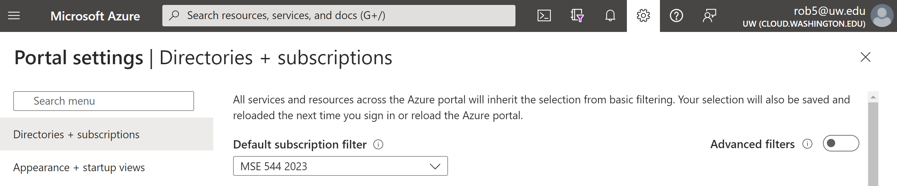
<BR><BR>
    
Above: The Azure portal has a gear icon for changing the account configuration.
    

* On a browser sign in to the [Azure portal](portal.azure.com) and verify your Subscription
    * Work in the (US) West US region when chosing your VM type (see below)
        * If West US is being difficult: Consider trying West US 2 etcetera alternatives
    * Check that you have an available *Resource Group*
        * Abbreviated RG: A Resource Group is a logical/virtual container for associated Azure resources
        * A Resource Group can contain for example a Virtual Machine (VM), a monitoring service and a Storage Account

<BR><BR>

<BR>
    
> ***Problems here? Check the [Potential Issues section below](#potential-issues).*** 

    
* From the Resource Group overview click `+Create`
   * This takes us to the Marketplace; search on `virtual machine` and select Virtual Machine
   * This takes us to the Virtual Machine Overview; click the Create button
* Use the **`Create a virtual machine`** tabbed wizard to customize a VM
    * There are 8 tabs to go through from **Basics** to **Disks** ... to **Review + create**
    * In what follows: If no direction is given just keep the default values
        * Basics tab
            * Verify Subscription and Resource group are correct
            * name = yournetid-mse544-vm
            * Region = (US) West US
                * I believe West US is correct...
                    * If you run into difficulty: Try US West 2
            * Image = Ubuntu Server 20.04 LTS - x64 Gen2 (where 'LTS' means a reliable version of Ubuntu)
            * VM architecture = x64
            * Run with Azure Spot discount: Leave box un-checked
            * Size: Click **`see all sizes`** and select **`Standard_D2as_v4 - 2 vcpus, 8 GiB memory`**
            * Authentication: SSH public key
            * Proceed to the next tab by clicking **`Next: Disks >`**
        * Disks tab
            * This is the one 'optional' part of creating an Azure VM (we recommend doing this if possible)
            * Click the link for **`Create and attach a new disk`**
            * Click **`Change size`**, select 4 GiB (much cheaper than 1024 GiB); click **`Ok`**
            * Click **`Next: Networking >`**
        * Networking tab: Nothing to do here; click **`Next: Management >`**
            * Notice in passing that SSH is assigned port 22. 
                * SSH ('secure shell') is a secure connection from one computer to another
        * Management tab: 
            * Click Enable auto-shutdown
            * Set a stop time, for example 5PM; select this time zone Pacific Time
            * This will stop the VM; not terminate it
            * We can also stop and re-start the VM from the Azure portal
            * Click **`Next: Monitoring >`**
        * Monitoring tab: Nothing to do here; click **`Next: Advanced >`**
        * Advanced tab: Nothing to do here; click **`Next: Tags >`**
        * Tags tab
            * For Name enter Project; for Value enter MSE544-<netid>
                * Notice this tag will attach to the VM and 12 additional associated resources
            * Click **`Next: Review + create >`**
        * Review + create
            * Look through the details to confirm they are correct
            * Click **`Create`**
            * Click **`Download private key and create resource`**
                * Store the key in a safe location (not a GitHub repo for example)
    * Your VM should be available in a minute
        * This is a good time to set up Cloud Shell to connect to your VM
            * Click the **`>_`** button at center-right on the Azure title bar
            * The Cloud Shell is described above in the Overview section
            * After it starts note you are in a User home directory
            * Make a subdirectory called `.ssh`: **`mkdir .ssh`**
            * Upload the private key file (that you just downloaded) from your computer to this directory
                * The Cloud Shell window has an upload button in the title bar
            * Make sure this file has *User read only* permission
                * `mv keyfile.pem .ssh` moves the file to the `.ssh` directory
                * `cd .ssh`
                * `chmod 400 keyfile.pem` modifies the file permissions
            * Toggle off your Cloud Shell

    
#### Potential issues

    
- ***Storage Creation Failed***
    - Expand “show advanced settings”
    - Choose your own RG 
    - choose Create your storage account
    - choose Create your file share (if none in your resource group)
- Can't see the **`.ssh`** folder from **`~`**
    - Folders starting with a period **`.`** are not visible to plain **`ls`** commands
    - Therefore: After **`cd ~`** use **`ls -al`** to list all folders
    - This folder **`.ssh`** is where you place VM access key files (`.pem` file extension)
        - The idea is to keep them out of the way but accessible
- `python3 -m pip` does not find `pip`. How to install **`pip`**?
    - Do a web search
    - I found these steps:
        - `sudo apt update`
        - `sudo apt install python3-pip`
        - test this install using `python3 -m pip`
    
   
### 2 Log in to the VM
   

[TOC](#table-of-contents)

    
* Once your VM is done building: Click **`Go to resource`**
* The VM Overview has a series of icons/actions from left to right at the top of the page
    * This includes **`Start`** if your VM is stopped
    * Click on the left-most: **`Connect`**
        * This **Connect** view has instructions for connecting to your VM
            * Note the ip address for your VM, for example `12.23.34.45`.
        * Return to the Cloud Shell and connect to your VM
            * `cd ~`
            * `ssh -i .ssh/keyfile.pem azureuser@12.23.34.45`
            * Confirm Yes you are sure when prompted about 'authenticity of the host'
            * Your prompt should now look like this: `azureuser@yournetid-mse544-vm`

    
* Enter `ps -p $$` to confirm you are using the bash shell
* Find out if Python is installed by entering `python`
    * In my case the OS suggests I try `python3` and this does run
    * `python3 --version` shows Python 3.8.10
    * `python3 -m pip list` shows that `requests` is installed
    * This suggests an experiment provided one has an Azure Serverless Function up and running
        * If you do not have such an Azure Function you can use this URL for the test from your VM: 
            * `https://rob5-function-app.azurewebsites.net/api/afunction?n=1234000`
        * Start Python: `python3` and enter the following 3 lines of code
        * `>>> import requests`
        * `>>> url = 'https://mynetid-function-app.azurewebsites.net/api/azurefunction?n=1234'`
        * `>>> print(requests.get(url).text)`
        * Use `exit()` to halt the Python interpreter
* Leave a fingerprint file to show you have modified the environment
    * `cd ~`
    * `touch fingerprint.txt`
    * `ls`
    
    
> If you added the (optional) data disk to your VM you can use the guide at
> [this link](https://learn.microsoft.com/en-us/azure/virtual-machines/linux/attach-disk-portal?tabs=ubuntu#find-the-disk)
> to make the disk available. This will take a few minutes. If you like you can also simply
> check that the disk is available using the following command.
    
```
lsblk -o NAME,HCTL,SIZE,MOUNTPOINT | grep -i "sd"
```

Here the 4GiB data disk is listed last as `sdc`.
    
```
sda     0:0:0:0      30G
├─sda1             29.9G /
├─sda14               4M
└─sda15             106M /boot/efi
sdb     1:0:1:0      14G
└─sdb1               14G /mnt
sdc     3:0:0:0       4G
```

    

### 3 Create a machine image from the VM

   
[TOC](#table-of-contents)


We will need a 'box' for images; and this is called an *Azure compute gallery*.
[This link](https://learn.microsoft.com/en-us/azure/virtual-machines/image-version) 
goes into more detail on Azure machine images. 
    
   
* On the portal: Create an **`Azure compute gallery`**
    * Search 'gallery' and select **`Azure compute galleries`** > **`+Create`**
    * Check for correct subscription and RG
    * Provide a name like `netid-compute-gallery`
    * Keep the region the same as for the VM (e.g. West US)
    * **`Review + create`** > **`Create`**
    * This gallery will be the 'box' in which we place VM images
    
    
* Select the VM in the Azure Portal and click **Capture**
    * 'Capture an image' wizard
        * Share image to Azure compute gallery
            * Select **Yes, share it to a gallery as a VM image version.**
        * **`Target VM image definition`**:
            * Select **`Create new`**
            * Enter required (red asterisk) values including a name like `yournetid-image-definition`
        * Review + Create > Create
            * Typically takes a couple of minutes > 'Deployment in progress' > Go to resource
            * The resulting VM image can be restarted on small low-cost machines or large high-cost machines
        * Note this remark in the wizard: 
            * **`Capturing a virtual machine image will make the virtual machine unusable. This action cannot be undone.`**
            * From this we expect something destructive happens to the VM... but we still have the image

    
### 4 Terminate your original VM and start a new VM from the image

    
[TOC](#table-of-contents)
   

Once you have created a VM image you should be able to safely delete your VM and 
then create a new one, same as the original, from the image.
    
- From the Azure portal locate your original VM > Delete (trash icon)
    - Select all check boxes, check 'I have read and understand...', click Delete
        - IF some resource check boxes are greyed out
            - This means you can't delete them
            - Not a concern; just delete what you can
            - If you are working with a spare data disk
                - Don't delete it
                - After you start a new VM from the image of the original: Try and attach this data disk
    
    
    
- From your Home location select your Azure Compute Gallery
    - Here the overview should list the VM image *definition* you created in part 3
    - Select this definition by clicking on it
        - This lists image *versions*, probably just the one most recent
        - Select this image version by clicking on it
            - Options for this image version include **`Create VM`** and **`Create VMSS`**
                - Do not click on **`Create VMSS`** (where **`SS`** stands for 'Scale Set')
                    - This feature allows you to create *multiple* VMs from a single image. (We just want one.)
                - ***Do*** click on **`Create VM`**
                    - This brings you to the familiar VM Create wizard
                        - Enter a new name for this new VM you create from your VM image
                        - You can skip to **`Review + create`** > **`Create`** > download a new key file
                        - Log in to the new VM as you did with the original
                            - Start the Cloud Shell
                            - Upload the key file to Cloud Shell, `~/.ssh` directory
                            - `chmod 400 key.pem`
                            - `ssh -i ~/.ssh/key.pem azureuser@12.23.34.45`
                            - We hope this recreates our source VM
                                - On the new VM: Is the fingerprint file present? 
                                - On the new VM: Are libraries already installed?


## Walkthrough for Jupyter

[TOC](#table-of-contents)

### Jupyter overview


    
[TOC](#table-of-contents)
    

As noted up at the top: Jupyter is an interactive programming (and story-telling) 
environment. We access this environment via a web browser. The center of mass of the 
Jupyter project is UC Berkeley. 
    
    
Here our objective is to install a Jupyter Hub on a single (small) Azure VM. 
This small-format Jupyter Hub is intended for just a few people. You might set this 
up for yourself and four colleagues, for example. 
In such a case, this Littlest Jupyter Hub provides five distinct Jupyter environments, 
one for each User. 
The 'big brother' full-scale version of a Jupyter Hub is built on a cluster of machines and can
serve six or a dozen or twenty or even a hundred or a thousand users. (That is an example of 
cloud scaling.)
    
    
Building a Littlest Jupyter Hub is going to be almost identical to the Monday activity
of starting an Azure VM. The small differences include adding in some Custom information
that will result in the **`Create`** step going the extra mile to set up the Jupyter Hub
service. 
    

After doing this Jupyter Hub build on the Azure portal you log in as the system 
administrator and make some modifications to the environment. You then clone a data 
science repository take a look at a Jupyter notebook therein. 
    

A Jupyter notebook consists of text boxes called cells. Some contain code and others 
contain markdown (formatted text). Cells are 'executed' individually using ctrl + enter
or shift + enter. 
    


### Website instructions

    
[TOC](#table-of-contents)


- The anchor point for the Littlest Jupyter Hub is [here](https://tljh.jupyter.org/en/latest/)...
    - But to get started go to this [Install to Azure](https://tljh.jupyter.org/en/latest/install/azure.html) page
    - and follow the steps provided...
        - after you first read the following
    
    
>***Caution 1: Since those instructions were created the VM Wizard has changed format; so just 
>about everything is still *there* but the order is a little scrambled. To help you navigate this
>the next section consists of screencaps of the various tabs in the wizard taken yesterday.***

    
>***Caution 2: Many of the Wizard choices are filled in properly by default. If it looks reasonable to you
>as-is just leave it that way; only change it if it contradicts what the instructions are asking you to modify.***


### Screencaps from the build

    
[TOC](#table-of-contents)


We begin in familiar territory: Making our way on the Azure portal to Virtual Machines and the **`Create+`** button

    
<BR><BR>
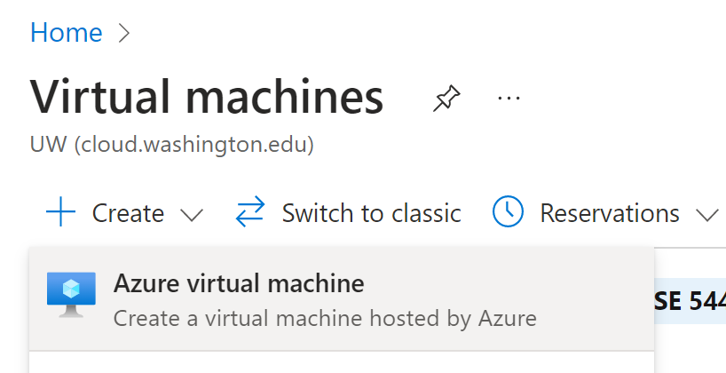
<BR><BR>
    

Once the wizard starts we see again there are eight tabs to work through. 
    

<BR><BR>
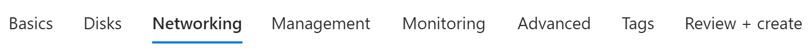
<BR><BR>
    
    
#### VM Wizard: **Basics** tab   


Click the link to **see all images** so you can select...
    
    
<BR><BR>
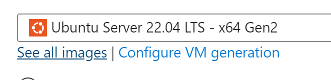
<BR><BR>
    
    

...Ubuntu Server 22.04 LTS

    
<BR><BR>
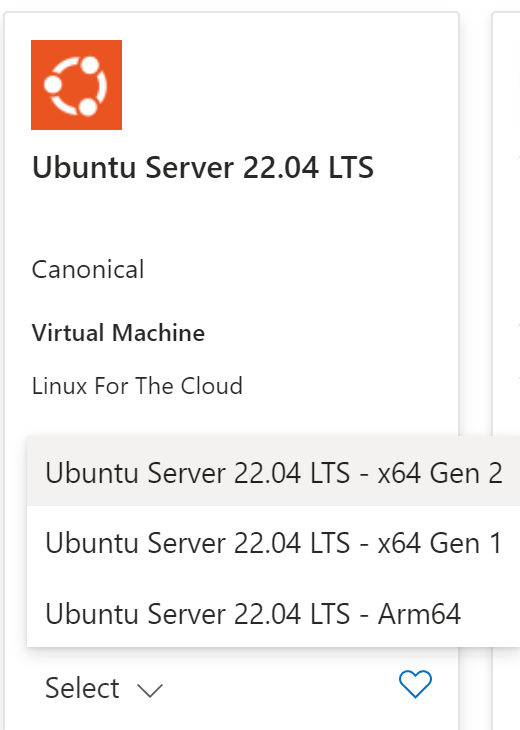
<BR><BR>
    
    

Instead of a key file (.pem) we will use a username (Example: **`mynetidadmin`**) and a password.


    
<BR><BR>
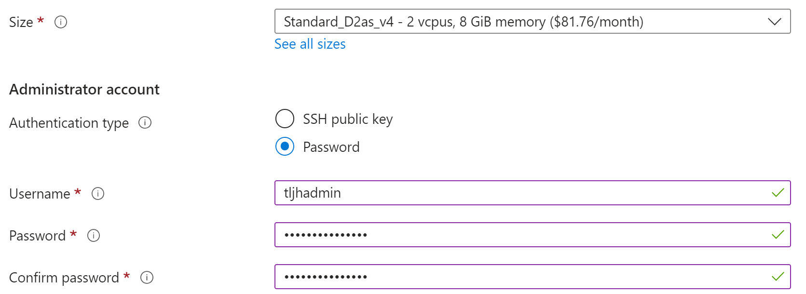
<BR><BR>

    
    
    
#### VM Wizard: **Discs** tab   


Nothing to do here.
    
    
#### VM Wizard: **Networking** tab   


Use the dropdown to co-select **`http`** and **`https`** in addition to **`ssh`**.
    

    
<BR><BR>
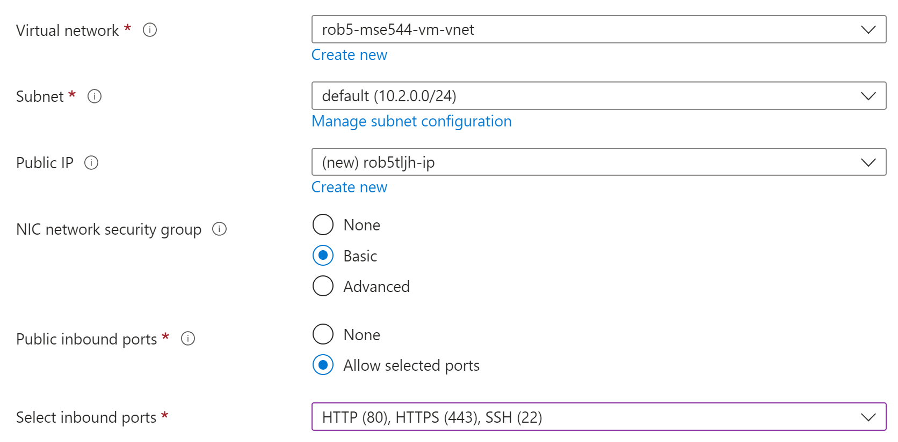
<BR><BR>
    
    
#### VM Wizard: **Management** tab   

 
    
<BR><BR>
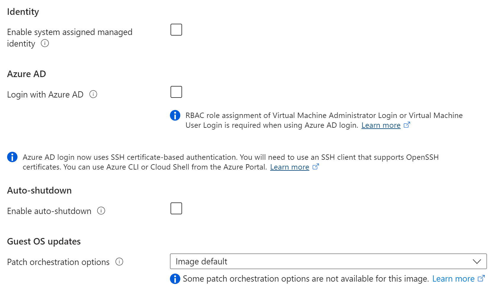
<BR><BR>
    

    
#### VM Wizard: **Monitoring** tab   

    
<BR><BR>
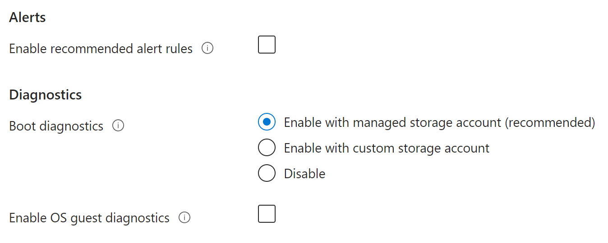
<BR><BR>
    
    
#### VM Wizard: **Advanced** tab   

    
    
Here at last is where the magic happens, in the **`Custom data`** script text box. 
The script you copy from the Littlest Jupyter instructions to this box (and be sure to modify
the admin username to be the one you entered on the Basics tab) 
will start to run once your VM is operational.
This will install the Jupyter Hub on your VM; but be warned it takes about ten minutes. 

    
    
<BR><BR>
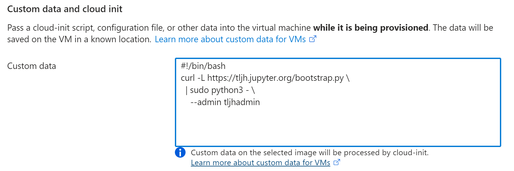
<BR><BR>
    
    
#### VM Wizard: **Tags** tab
    
    
Nothing to do here.
    
    
#### VM Wizard: **Review and Create** tab
    
    
Make sure everything looks ok and click Create. 
There is no key file to download because we switched to using a password.

    
<BR><BR>
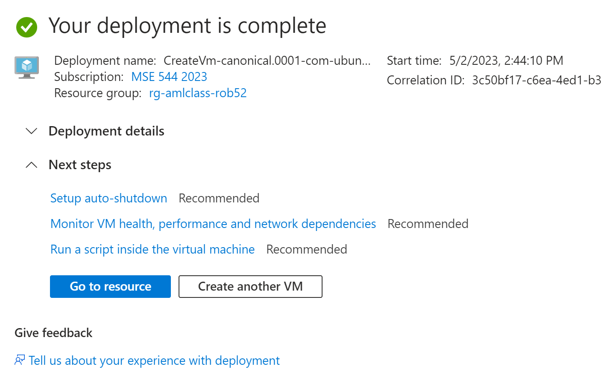
<BR><BR>

Once the Jupyter Hub installation is completed (remember this takes about 10 minutes): Paste the ip address 
of your VM into a browser tab address window. If you try entering the ip address and nothing useful happens: 
It is not done installing yet. You can monitor your install progress at this location: Your VM resource
page, **`boot diagnostics`** (left sidebar), **`Serial log`** tab. 

    
<BR><BR>
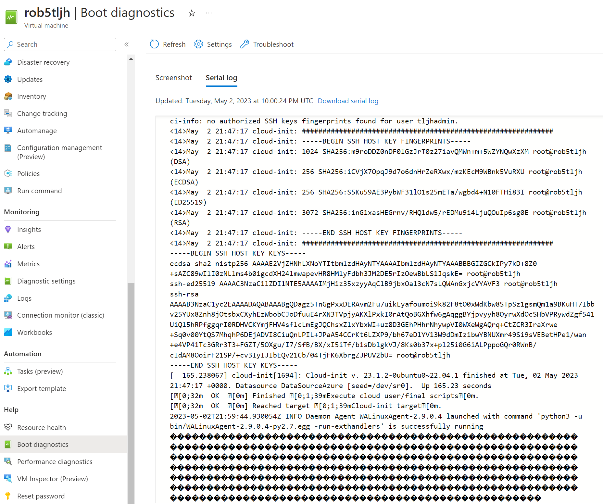
<BR><BR>
    
    
At this point, when the Littlest Jupyter Hub install is done, you should be able to log in as
the administrator User. Try starting a Jupyter notebook; then create and run a cell.
    


    
### Install libraries

    
[TOC](#table-of-contents)


The objective is now to modify the Jupyter Hub environment by installing some packages.    
At this point the instructions and screencaps are great; no need for 'updated' screencaps. 
In addition to the **`gdal`** and **`there`** library installs: Also install these packages:
    

```
sudo -E pip install matplotlib
sudo -E pip install xarray[complete] 
```

    
    
### Clone and examine a data science repository
    
This is a stretch activity. 
Start a terminal (still logged in as the admin) and run this `git` command: 
    
    
```
cd ~
git clone https://github.com/robfatland/ocean
```
    
Now you should have a folder called `ocean` in the navigator. Navigate to this folder 
and start the notebook called **`Biooptics.ipynb`**. Use the Run menu to run all of 
the cells in this notebook. This will take a minute or two; and when it is done you
might take a moment to look through the results. You can also see the markdown behind
the rendering by double-clicking on a text cell.
    


