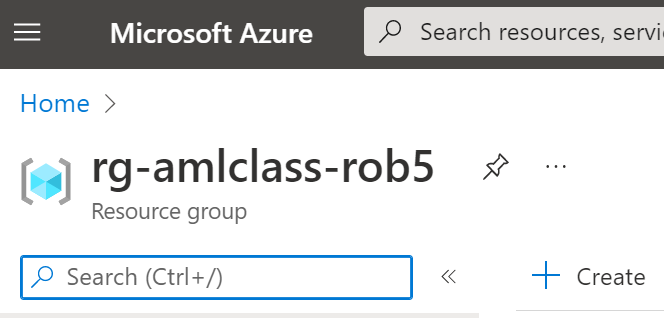
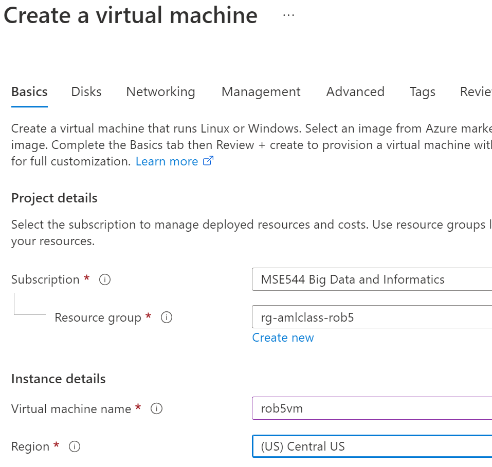
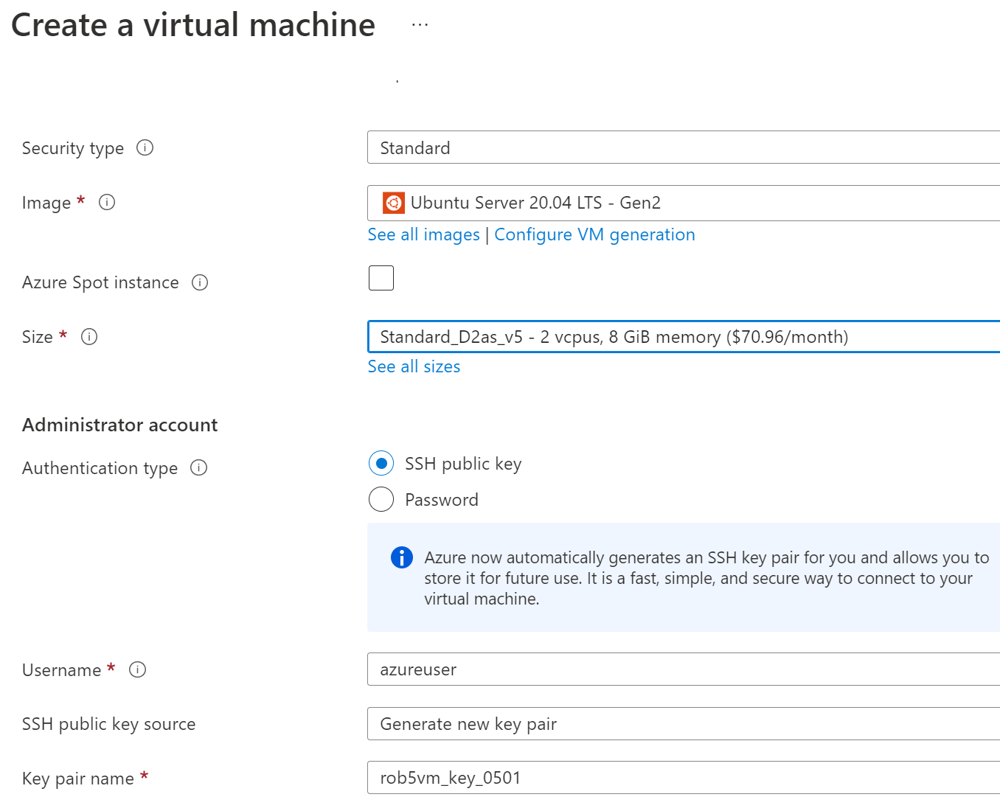
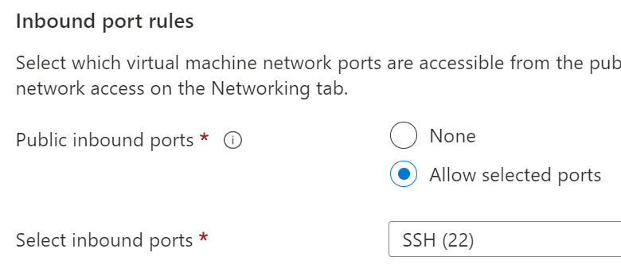
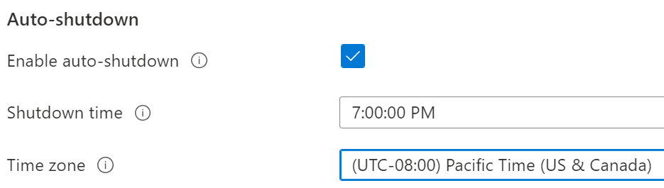
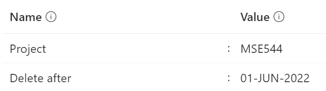
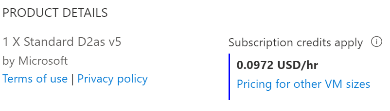
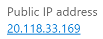
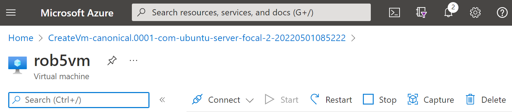

# MSE544 Creating a VM + image on the Azure cloud

[TOC](#table-of-contents)


[Jump to hands-on activity](#walkthrough-for-vms-day-1)


## Table of contents

- [Overview](#overview)
    - [The Plan](#the-plan)
    - [Azure Cloud Shell](#azure-cloud-shell)
    - [Object and block storage on the cloud](#object-and-block-storage-on-the-cloud)
    - [Python environments](#python-environments)
    - [git and GitHub](#git-and-github)
    - [Jupyter](#jupyter)
- [Walkthrough for VMs day 1](#walkthrough-for-vms-day-1)
    - [Start a VM on Azure](#1-start-a-vm-on-azure)
    - [Log in to the VM](#2-log-in-to-the-vm)
    - [Create a machine image from the VM](#3-create-a-machine-image-from-the-vm)
    - [Terminate your original VM and start a new VM from the image](#4-terminate-your-original-vm-and-start-a-new-vm-from-the-image)


## Overview


### The Plan 


[TOC](#table-of-contents)


Read through this overview and proceed to the walkthrough activities for
Virtual Machines (VMs) on Azure. VMs are self-contained computers; also called ***instances***. 
A single physical computer may host more than one Virtual Machine.  
On the cloud 
an ***instance type*** means a VM with specifications: How much CPU power, memory, storage, and 
networking speed. We will use a fairly light VM that costs about \$0.11 per hour.


We pay at some rate for a VM 'per hour' until we **Stop** it. Unfortunately this immediately runs into
some confusing language on Azure: A VM that is *Stopped and Deallocated* is equivalent to a computer that
is turned off; and we do not pay for it on Azure (but it is still available to be turned back on). 
A VM that is merely *stopped* on Azure
(not *deallocated*) is still sitting there costing money. **`sudo shutdown -h now`** will stop, 
but not deallocate, a VM. 


A VM is distinct from a ***container***: A container makes use of a computer's underlying operating system; 
and it starts up very quickly. It is a (possibly very substantial) program that runs on a host computer. A VM
includes its own complete operating system; plus anything we choose to install on it; plus our code and our
data. So a VM is a computer running on a computer. A VM can also have an IP address; and can exist on the web 
as a server. It could host a *non-serverless* function. 


On Azure we have root access on any VMs we create. We log in to the VM via a bash shell and then when necessary
wield root access by means of the **`sudo`** (super-user-do) command. 


On the cloud we select a VM by choosing both an ***instance type*** and an ***operating system***. 
The instance type
matches the computer's purpose in processing power, memory, network speed and other features. 


Technical detail: The operating system choice in fact selects a *machine image* that includes
this operating system. Once the VM starts we are free to log on and customize it. Then we will
save a *new* image which is a snapshot of the modified VM. This new image is tied to our Azure
account; so we can terminate the VM at this point (all signs of it are gone) and restart our
saved image. This creates a new VM or if we like, even *multiple* such VMs. This is the central
idea of VM images as backups of our computing environment; and as a basis for scaling. In fact
a given image can be restored to a larger, more powerful VM; or a smaller, less powerful VM
depending on its intended use. We can also use a VM image as a building block for
an Azure ['Scale Set'](https://azure.microsoft.com/en-us/products/virtual-machine-scale-sets),
a veritable herd of identical VMs useful for doing batch processing. 


As with many Azure resources there is
a logical 'box' for VM images called a **`Gallery`**.


The VM we use costs $0.11 per hour. A good rule of thumb is: Establish an alarm
that shuts down (*stop* plus *deallocate*) the VM every evening. We do this in the setup process.
Azure sends us an email that the machine is going to be stopped soon and 
provides an option to keep it running a bit longer.


#### VM Day 1 Monday May 1


- Start a VM on the Azure cloud in your Resource Group
    - Optional: Add a small (4GB) data disk
    - Obtain two artifacts: The VM ip address and a key file to authenticate
- Start Cloud Shell on Azure: This is a bash shell that runs in the browser
    - Recreate the key file from above: on the Cloud Shell
    - Log in to the Azure VM from the Cloud Shell
    - Optional: Mount the data disk
    - Modify the VM by installing a library and creating a file
        - Now the VM is 'customized'
- Capture the VM to an image in a gallery
- Terminate the VM
- Re-start the VM from the image
- Log in to the new VM from Cloud Shell and verify the changes made are still there
- Stop the VM from the Azure portal


#### VM Day 2 Tuesday May 3


- On the VM
    - Install a Jupyter service supporting IPython notebooks
    - Clone a repository containing some notebooks
- On your computer
    - Use your browser to log in to the Jupyter service you created above
    - Verify everything works
- *Stretch task: Place some data in object storage on Azure and access that from your VM
- Terminate your VM (good practice when done)

### [Azure Cloud Shell](https://learn.microsoft.com/en-us/azure/cloud-shell/overview)

- We have found that VSCode supports Power Shell and the Ubuntu `bash` shell
- To avoid VSCode for this VM work we instead use a shell built into the Azure portal
- This is called the **`Cloud Shell`** and it has these features
    - We toggle it on/off using the icon **`>_`** in the title bar just right of center
    - It takes a moment to start
    - It logs us in to a `bash` shell computing environment complete with a filesystem
        - At this point you might be thinking 'Wow this sounds like a Container'
        - You are absolutely correct, this is a Container
    - Here we treat Cloud Shell like a useful computer with a persistent memory
        - It can run in either `bash` or `Power Shell` mode
        - Here are some familiarization steps for Cloud Shell
            - `python --version` to see which Python runs
            - `python -m pip list` to see installed libraries: Notice `pandas` is not listed.
            - `python -m pip install pandas` and verify it is installed now
            - Use the 'restart' button to restart Cloud Shell; and verify `pandas` is still installed
            - Notice there is an upload button on the Cloud Shell title bar
                - This will come in handy for uploading the key file for the VM, see below


### Object and block storage on the cloud


[TOC](#table-of-contents)


* Block storage equates to disk drives: A root drive and optional additional drives: Attached to a VM
    * Fast access, \$0.09 per GB per month
* Contrast: Object storage
    * On Azure this is called 'blob storage'
    * It is not attached to a VM
    * It is located within a **`Storage account`**
    * Cost 25% of block storage
    * Supports organizing files in a directory structure
    * Does not permit scanning files
        * Instead: Read a file of interest directly into memory or copy it to block storage
    * Data archival available: Less frequent access, less cost


### Python environments


[TOC](#table-of-contents)


To review: Python features a level of virtualization (specialization) via *virtual environments*. 
The Python *base* environment is the Python interpreter and libraries that comprise the
basic Python installation in the operating system. From this base or default environment a Python 
virtual environment is often created as a dedicated space to further customize the workspace. 


### git and GitHub


[TOC](#table-of-contents)


To review: GitHub is a provider of Internet hosting for software development and version control using **`git`**. 
**`git`** is in turn a Linux software version control utility. GitHub and similar hosting
sites facilitate open sharing of software, part of the larger picture of reproducible research.


- The **`git clone`** command can be used clone GitHub *repositories*,  
thematic collections of files in a directory tree. 


- **`git`** comes with a learning curve.


- Improper use of GitHub can grant cloud access to Bad Actors. This in turn can lead to lost time and money.


### Jupyter


[TOC](#table-of-contents)


Jupyter is an interactive coding environment. Here are some of the key terms defined.


- [**IPython**](https://en.wikipedia.org/wiki/IPython) 
is short for **Interactive Python**, a command shell for interactive computing. 
It supports multiple languages including, of course, Python.


- Jupyter notebook: A file with an IPython file extension **`.ipynb`** that is hosted
by a Jupyter notebook server, viewed in a browser, consists of text blocks called *cells*
that contain either code or formatted text
    - This results in an environment that combines
exploratory data analysis (code) with explanations and other documentation.


- Jupyter notebook server: An interactive development environment that hosts Jupyter notebooks

 
- Jupyter Lab: The current version of the Jupyter notebook server
    - Also a web-based interactive development environment


- [Jupyter Book](https://jupyterbook.org/explain/components.html): A wrapper around a collection 
of tools in the Python ecosystem that make it easier to publish computational documents


- Jupyter Hub is a means of providing Jupyter notebook servers to a group of users
    - For example a research team
    - ...provides computational environments without burdening users with installation and maintenance


> Jupyter notebook code execution is managed by a language-specific program 
called a kernel (for example 'Python kernel', 'R kernel', 'Julia kernel').  
The kernel operates "behind the scenes" to maintain the notebook environment and
run blocks of code as requested. We use Python, 
and the two other primary Jupyter-supported languages are Julia and R 
(hence 'JuPyt(e)R'). In the spirit of expansibility many other kernels have
been developed: There are
more than 100 Jupyter kernels available at this time. 


## Walkthrough for VMs day 1


[TOC](#table-of-contents)


### 1 Start a VM on Azure


[TOC](#table-of-contents)


* On a browser sign in to the [Azure portal](portal.azure.com) and verify your Subscription
    * Work in the (US) West US region when chosing your VM type (see below)
    * Check that you have an available *Resource Group*
        * Abbreviated RG: A Resource Group is a logical/virtual container for associated Azure resources
        * A Resource Group can contain for example a Virtual Machine (VM), a monitoring service and a Storage Account

<BR><BR>

<BR>

* From the Resource Group overview click `+Create`
   * This takes us to the Marketplace; search on `virtual machine` and select Virtual Machine
   * This takes us to the Virtual Machine Overview; click the Create button
* Use the **`Create a virtual machine`** tabbed wizard to customize a VM
    * There are 8 tabs to go through from **Basics** to **Disks** ... to **Review + create**
    * In what follows: If no direction is given just keep the default values
        * Basics tab
            * Verify Subscription and Resource group are correct
            * name = yournetid-mse544-vm
            * Region = (US) West US
            * Image = Ubuntu Server 20.04 LTS - x64 Gen2 (where 'LTS' means a reliable version of Ubuntu)
            * VM architecture = x64
            * Run with Azure Spot discount: Leave box un-checked
            * Size: Click **`see all sizes`** and select **`Standard_D2as_v4 - 2 vcpus, 8 GiB memory`**
            * Authentication: SSH public key
            * Proceed to the next tab by clicking **`Next: Disks >`**
        * Disks tab
            * This is the one 'optional' part of creating an Azure VM (we recommend doing this if possible)
            * Click the link for **`Create and attach a new disk`**
            * Click **`Change size`**, select 4 GiB (much cheaper than 1024 GiB); click **`Ok`**
            * Click **`Next: Networking >`**
        * Networking tab: Nothing to do here; click **`Next: Management >`**
            * Notice in passing that SSH is assigned port 22. 
                * SSH ('secure shell') is a secure connection from one computer to another
        * Management tab: 
            * Click Enable auto-shutdown
            * Set a stop time, for example 5PM; select this time zone Pacific Time
            * This will stop the VM; not terminate it
            * We can also stop and re-start the VM from the Azure portal
            * Click **`Next: Monitoring >`**
        * Monitoring tab: Nothing to do here; click **`Next: Advanced >`**
        * Advanced tab: Nothing to do here; click **`Next: Tags >`**
        * Tags tab
            * For Name enter Project; for Value enter MSE544-<netid>
                * Notice this tag will attach to the VM and 12 additional associated resources
            * Click **`Next: Review + create >`**
        * Review + create
            * Look through the details to confirm they are correct
            * Click **`Create`**
            * Click **`Download private key and create resource`**
                * Store the key in a safe location (not a GitHub repo for example)
    * Your VM should be available in a minute
        * This is a good time to set up Cloud Shell to connect to your VM
            * Click the **`>_`** button at center-right on the Azure title bar
            * The Cloud Shell is described above in the Overview section
            * After it starts note you are in a User home directory
            * Make a subdirectory called `.ssh`: **`mkdir .ssh`**
            * Upload the private key file (that you just downloaded) from your computer to this directory
                * The Cloud Shell window has an upload button in the title bar
            * Make sure this file has *User read only* permission
                * `mv keyfile.pem .ssh` moves the file to the `.ssh` directory
                * `cd .ssh`
                * `chmod 400 keyfile.pem` modifies the file permissions
            * Toggle off your Cloud Shell
   
### 2 Log in to the VM
   

[TOC](#table-of-contents)

    
* Once your VM is done building: Click **`Go to resource`**
* The VM Overview has a series of icons/actions from left to right at the top of the page
    * This includes **`Start`** if your VM is stopped
    * Click on the left-most: **`Connect`**
        * This **Connect** view has instructions for connecting to your VM
            * Note the ip address for your VM, for example `12.23.34.45`.
        * Return to the Cloud Shell and connect to your VM
            * `cd ~`
            * `ssh -i .ssh/keyfile.pem azureuser@12.23.34.45`
            * Confirm Yes you are sure when prompted about 'authenticity of the host'
            * Your prompt should now look like this: `azureuser@yournetid-mse544-vm`

    
* Enter `ps -p $$` to confirm you are using the bash shell
* Find out if Python is installed by entering `python`
    * In my case the OS suggests I try `python3` and this does run
    * `python3 --version` shows Python 3.8.10
    * `python3 -m pip list` shows that `requests` is installed
    * This suggests an experiment provided one has an Azure Serverless Function up and running
        * If you do not have such an Azure Function you can use this URL for the test from your VM: 
            * `https://rob5-function-app.azurewebsites.net/api/afunction?n=1234000`
        * Start Python: `python3` and enter the following 3 lines of code
        * `>>> import requests`
        * `>>> url = 'https://mynetid-function-app.azurewebsites.net/api/azurefunction?n=1234'`
        * `>>> print(requests.get(url).text)`
        * Use `exit()` to halt the Python interpreter
* Leave a fingerprint file to show you have modified the environment
    * `cd ~`
    * `touch fingerprint.txt`
    * `ls`
    
    
> If you added the (optional) data disk to your VM you can use the guide at
> [this link](https://learn.microsoft.com/en-us/azure/virtual-machines/linux/attach-disk-portal?tabs=ubuntu#find-the-disk)
> to make the disk available. This will take a few minutes. If you like you can also simply
> check that the disk is available using the following command.
    
```
lsblk -o NAME,HCTL,SIZE,MOUNTPOINT | grep -i "sd"
```

Here the 4GiB data disk is listed last as `sdc`.
    
```
sda     0:0:0:0      30G
├─sda1             29.9G /
├─sda14               4M
└─sda15             106M /boot/efi
sdb     1:0:1:0      14G
└─sdb1               14G /mnt
sdc     3:0:0:0       4G
```

    

### 3 Create a machine image from the VM

   
[TOC](#table-of-contents)


   
* Select the VM in the Azure Portal and click **Capture**
* 'Create an image' wizard
    * Share image to Azure compute gallery: Select **No, capture only a managed image**
    * Review + Create > Create
        * Typically takes a couple of minutes > 'Deployment in progress' > Go to resource
        * The resulting VM image can be restarted on small low-cost machines or large high-cost machines


### 4 Terminate your original VM and start a new VM from the image

    
[TOC](#table-of-contents)
   

- From the Azure portal locate your original VM > Delete (trash icon)
    - Select all check boxes, check 'I have read and understand...', click Delete
- From your Home location select your Azure Compute Gallery
    - Here the overview should list the VM image you created in part 3; so select this image by clicking on it
    - There will be a series of options including **`Add version`**, **`Create VM`** and **`Create VMSS`**
        - Do not click on **`Create VMSS`**: This creates *multiple* VMs from a single image. (We just want one.)
        - ***Do*** click on **`Create VM`**
        - This brings you back to the familiar VM Create wizard; so enter a new name for this VM
        - You can skip to **`Review + create`**, click on **`Create`** and download a new key file
        - Log in to this new VM as with the previous one
            - Start the Cloud Shell
            - Upload the key file from where you saved it to the Cloud Shell `~/.ssh` directory
            - Use `chmod 400 key.pem` to give this file the necessary permissions
            - Use `ssh -i ~/.ssh/key.pem azureuser@12.23.34.45` to log in to the new VM
        - Once you have logged in: Check to see that your fingerprint file and any other changes are there on the new VM

    
    
# Notes on Day 2
    
    
This section 'under construction' will be updated before the Wednesday May 3 class.
   

## Installing a Jupyter Notebook server on an Azure VM
   

* Is the Jupyter Notebook server installed? Enter `jupyter` to find out that it is not
    * This sets us off on the path of customizing the VM
    * One approach is to install a Littlest Jupyter Hub
    * Another approach is to search 'how to install jupyter on ubuntu'
        * This turns up a number of instructive websites including
[this one](https://www.digitalocean.com/community/tutorials/how-to-set-up-jupyter-notebook-with-python-3-on-ubuntu-18-04).
        * The commands are copied in sequence below
    
    
An important difference in these two approaches: The first one is more about 'team' thinking as the 
Jupyter Hub can provide Jupyter notebook servers to multiple team members. 


### The Littlest Jupyter Hub approach
    
    
### The Single Jupyter Notebook Server approach
    

Enter the following commands in sequence. Some steps require confirmation so it is
best to run each command to completion before entering the next. Emphasis: These are commands you are
entering on your VM bash command prompt `azureuser@myVMname:~$ `, ***not*** on your local computer. 

   
```
azureuser@myVMname:~$ sudo apt update
azureuser@myVMname:~$ sudo apt upgrade
azureuser@myVMname:~$ sudo apt install python3-pip python3-dev
azureuser@myVMname:~$ sudo -H pip3 install --upgrade pip
azureuser@myVMname:~$ sudo -H pip3 install virtualenv
azureuser@myVMname:~$ virtualenv my_project_env
```

   
Activate the virtual environment **`my_project_env`**; which changes the prompt.
Run this command after logging back in to this VM: Ensure the prompt begins
with `(my_project_env)`.

   
```
azureuser@myVMname:~$ source my_project_env/bin/activate
```

Install the Jupyter notebook server and some Python data science libraries.
   
```
(my_project_env) azureuser@myVMname:~$ pip install jupyter
(my_project_env) azureuser@myVMname:~$ pip install matplotlib
(my_project_env) azureuser@myVMname:~$ pip install numpy
(my_project_env) azureuser@myVMname:~$ pip install xarray
(my_project_env) azureuser@myVMname:~$ pip install netcdf4
```
   

> To reiterate: Always begin a session on this VM by activating the environment *my_project_env* 
by running `source my_project_env/activate`. This is necessary because `jupyter` is installed
only in this environment; not in the login or base environment. 
   

Test the installation by typing `jupyter` again. The VM should now recognize and run this command.


### Clone an oceanography repository
   

We can clone some open source content from the GitHub software control website.
   
```
(my_project_env) azureuser@myVMname:~$ cd ~
(my_project_env) azureuser@myVMname:~$ git clone https://github.com/robfatland/ocean
```
   
This should complete in under a minute. You can use `ls` to show there is a new directory called `ocean`. 
It contains data and some IPython notebooks. 


### Start the Jupyter Notebook server
   

The Jupyter Notebook server interface exists in a browser window. 
However, at this time our VM is not connected in any manner to a local browser.
The only connection we have is a bash shell (text window) enabled via an `ssh` connection. 
The trick here is to use this secure `ssh` connection from your host machine to the Azure VM.
 
   
On the VM command line issue this command. The prompt is included as a reminder that 
you must have the `my_project_env` environment activated as described above.
  
   
```
(my_project_env) azureuser@myVMname:~$ (jupyter notebook --no-browser --port=8889) &
```
   
   
The trailing ampersand runs the command as a background job. 
This will produce output something like: 
   
   
```
[1] 1581
(my_project_env) azureuser@rob5vm:~$ [I 18:04:32.793 NotebookApp] Serving notebooks from local directory: /home/azureuser
[I 18:04:32.793 NotebookApp] Jupyter Notebook 6.4.11 is running at:
[I 18:04:32.793 NotebookApp] http://localhost:8889/?token=ab39283485838005ef2e564689f62e7150acdef483cfe751
[I 18:04:32.793 NotebookApp]  or http://127.0.0.1:8889/?token=ab39283485838005ef2e564689f62e7150acdef483cfe751
[I 18:04:32.793 NotebookApp] Use Control-C to stop this server and shut down all kernels (twice to skip confirmation).
[C 18:04:32.798 NotebookApp]

    To access the notebook, open this file in a browser:
        file:///home/azureuser/.local/share/jupyter/runtime/nbserver-1581-open.html
    Or copy and paste one of these URLs:
        http://localhost:8889/?token=ab39283485838005ef2e564689f62e7150acdef483cfe751
     or http://127.0.0.1:8889/?token=ab39283485838005ef2e564689f62e7150acdef483cfe751
```

   
The Jupyter notebook server will "listen" on port 8889 for interactive information.
Until that shows up: It waits patiently.
   

### Create an `SSH` tunnel from your computer to the VM
   
   
On your computer use the `ssh` command to create a tunnel to the VM.
Specifically this connects port 8890 on your computer to port 8889 on the Azure VM.
Remember to use the correct ip address for your VM.
   

```
ssh -N -f -i ./rob5vm_key.pem -L localhost:8890:localhost:8889 azureuser@31.92.184.12
```
   
   
This will direct local traffic to port 8890 to the Azure VM's port 8889. That port connects to
the Jupyter Notebook server. 
   
   
The final step is to enter a modified version of the VM Jupyter 
URL ***into your browser address bar***. This is the URL that printed when you started the Jupyter
Notebook server above. It includes a long token string for authentication. It also includes
port number 8889; but this must be modified to 8890, your local SSH tunnel port.
   
```
http://localhost:8890/?token=ab39283485838005ef2e564689f62e7150acdef483cfe751
```

Verify that the Jupyter Notebook server runs and provides you with access to the `ocean` repository contents. 
You can use the browser interface to move into the `ocean` folder and start the `BioOptics` notebook in a 
separate tab. Use the **Run** button at the top center of the BioOptics tab to execute a series of cells.

    
> The BioOptics Python cells run without error because the necessary libraries were installed above.

   

Stretch activity: Start a new VM from this image. Start as before with "Create a virtual machine".
This time for Image select "See all images" and then in the left menu select "My Images". This 
should show the image created above as a choice. Go through the setup wizard as before, click
Create, and download the new key file. Log in to the new VM with `ssh -i keyfile.pem azureuser@123.234.123.234`. 
   
Once you have logged in to the new VM, ensure jupyter is installed after activating the environment as before.
   
```
source my_project_env/bin/activate
jupyter
ls
```
   
This "closes the loop": We have created a data science VM on the Azure cloud, customized it, 
saved it as an image, reconstituted a second VM from that image, and demonstrated that the new VM
has all the previous VM's customization built in.


   
## Re-starting a VM

   
If your earlier session was interrupted and/or your Virtual Machine was set to auto-halt
every day at some time: It may currently be Stopped and Deallocated. Restart it
in the Azure portal by selecting the VM and clicking the **Start** button.
This will assign your VM a new ip address; so note this down.
   

You can assign a static ip address to your VM (this is an Azure service) so it will
always have the same ip address whenever it is started up again. 
   

## Anaconda

   
Suppose we are interested in using a data science distribution of Python. Commonly used is
[***Anaconda***](https://anaconda.com). It installs with a large collection of data science 
libraries. 
   
   
Note: We are not doing this as part of the hands-on walk-through; Anaconda is just mentioned here
in passing. 
   
   
One method of installing Anaconda is to use the `wget` Linux command to copy the installation shell script
(file extension `.sh`) from the web to a local environment; and then use the `bash` command to run the 
script. It is worth checking the [Anaconda repository](https://repo.anaconda.com/archive/)
for a recent version; and the [Anaconda main website](https://anaconda.com) for other installation options. 
There is also a lightweight version of Anaconda called Miniconda that does not include so many features.
   

One Anaconda installation command sequence (Linux, circa 2022):
   

```
wget https://repo.anaconda.com/archive/Anaconda3-2021.11-Linux-x86_64.sh
bash Anaconda3-2020.11-Linux-x86_64.sh
```

    
    
## Images from prior version of the walkthrough

    
<BR><BR>

<BR><BR><BR>

<BR><BR><BR>

<BR><BR><BR>

<BR><BR><BR>

<BR><BR><BR>

<BR><BR><BR>

<BR><BR><BR>

<BR><BR><BR>

<BR>

