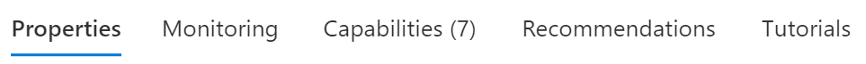

[Table of Contents](#table-of-contents)


## Table of Contents


- [Overview](#overview)
- [Littlest](#littlest)


## Overview

<BR><BR>

<BR><BR>

## Littlest
  
- Do not go to the [Littlest JupyterHub home](https://tljh.jupyter.org/en/latest/) page
- ***Do*** go to the [Install to Azure](https://tljh.jupyter.org/en/latest/install/azure.html) page
- Do not go to the [Deploy to Azure button](https://github.com/trallard/TLJH-azure-button) page
  
  
This section 'under construction' will be updated before the Wednesday May 3 class.
   

## Installing a Jupyter Notebook server on an Azure VM
   

* Is the Jupyter Notebook server installed? Enter `jupyter` to find out that it is not
    * This sets us off on the path of customizing the VM
    * One approach is to install a Littlest Jupyter Hub
    * Another approach is to search 'how to install jupyter on ubuntu'
        * This turns up a number of instructive websites including
[this one](https://www.digitalocean.com/community/tutorials/how-to-set-up-jupyter-notebook-with-python-3-on-ubuntu-18-04).
        * The commands are copied in sequence below
    
    
An important difference in these two approaches: The first one is more about 'team' thinking as the 
Jupyter Hub can provide Jupyter notebook servers to multiple team members. 


### The Littlest Jupyter Hub approach
    
    
### The Single Jupyter Notebook Server approach
    

Enter the following commands in sequence. Some steps require confirmation so it is
best to run each command to completion before entering the next. Emphasis: These are commands you are
entering on your VM bash command prompt `azureuser@myVMname:~$ `, ***not*** on your local computer. 

   
```
azureuser@myVMname:~$ sudo apt update
azureuser@myVMname:~$ sudo apt upgrade
azureuser@myVMname:~$ sudo apt install python3-pip python3-dev
azureuser@myVMname:~$ sudo -H pip3 install --upgrade pip
azureuser@myVMname:~$ sudo -H pip3 install virtualenv
azureuser@myVMname:~$ virtualenv my_project_env
```

   
Activate the virtual environment **`my_project_env`**; which changes the prompt.
Run this command after logging back in to this VM: Ensure the prompt begins
with `(my_project_env)`.

   
```
azureuser@myVMname:~$ source my_project_env/bin/activate
```

Install the Jupyter notebook server and some Python data science libraries.
   
```
(my_project_env) azureuser@myVMname:~$ pip install jupyter
(my_project_env) azureuser@myVMname:~$ pip install matplotlib
(my_project_env) azureuser@myVMname:~$ pip install numpy
(my_project_env) azureuser@myVMname:~$ pip install xarray
(my_project_env) azureuser@myVMname:~$ pip install netcdf4
```
   

> To reiterate: Always begin a session on this VM by activating the environment *my_project_env* 
by running `source my_project_env/activate`. This is necessary because `jupyter` is installed
only in this environment; not in the login or base environment. 
   

Test the installation by typing `jupyter` again. The VM should now recognize and run this command.


### Clone an oceanography repository
   

We can clone some open source content from the GitHub software control website.
   
```
(my_project_env) azureuser@myVMname:~$ cd ~
(my_project_env) azureuser@myVMname:~$ git clone https://github.com/robfatland/ocean
```
   
This should complete in under a minute. You can use `ls` to show there is a new directory called `ocean`. 
It contains data and some IPython notebooks. 


### Start the Jupyter Notebook server
   

The Jupyter Notebook server interface exists in a browser window. 
However, at this time our VM is not connected in any manner to a local browser.
The only connection we have is a bash shell (text window) enabled via an `ssh` connection. 
The trick here is to use this secure `ssh` connection from your host machine to the Azure VM.
 
   
On the VM command line issue this command. The prompt is included as a reminder that 
you must have the `my_project_env` environment activated as described above.
  
   
```
(my_project_env) azureuser@myVMname:~$ (jupyter notebook --no-browser --port=8889) &
```
   
   
The trailing ampersand runs the command as a background job. 
This will produce output something like: 
   
   
```
[1] 1581
(my_project_env) azureuser@rob5vm:~$ [I 18:04:32.793 NotebookApp] Serving notebooks from local directory: /home/azureuser
[I 18:04:32.793 NotebookApp] Jupyter Notebook 6.4.11 is running at:
[I 18:04:32.793 NotebookApp] http://localhost:8889/?token=ab39283485838005ef2e564689f62e7150acdef483cfe751
[I 18:04:32.793 NotebookApp]  or http://127.0.0.1:8889/?token=ab39283485838005ef2e564689f62e7150acdef483cfe751
[I 18:04:32.793 NotebookApp] Use Control-C to stop this server and shut down all kernels (twice to skip confirmation).
[C 18:04:32.798 NotebookApp]

    To access the notebook, open this file in a browser:
        file:///home/azureuser/.local/share/jupyter/runtime/nbserver-1581-open.html
    Or copy and paste one of these URLs:
        http://localhost:8889/?token=ab39283485838005ef2e564689f62e7150acdef483cfe751
     or http://127.0.0.1:8889/?token=ab39283485838005ef2e564689f62e7150acdef483cfe751
```

   
The Jupyter notebook server will "listen" on port 8889 for interactive information.
Until that shows up: It waits patiently.
   

### Create an `SSH` tunnel from your computer to the VM
   
   
On your computer use the `ssh` command to create a tunnel to the VM.
Specifically this connects port 8890 on your computer to port 8889 on the Azure VM.
Remember to use the correct ip address for your VM.
   

```
ssh -N -f -i ./rob5vm_key.pem -L localhost:8890:localhost:8889 azureuser@31.92.184.12
```
   
   
This will direct local traffic to port 8890 to the Azure VM's port 8889. That port connects to
the Jupyter Notebook server. 
   
   
The final step is to enter a modified version of the VM Jupyter 
URL ***into your browser address bar***. This is the URL that printed when you started the Jupyter
Notebook server above. It includes a long token string for authentication. It also includes
port number 8889; but this must be modified to 8890, your local SSH tunnel port.
   
```
http://localhost:8890/?token=ab39283485838005ef2e564689f62e7150acdef483cfe751
```

Verify that the Jupyter Notebook server runs and provides you with access to the `ocean` repository contents. 
You can use the browser interface to move into the `ocean` folder and start the `BioOptics` notebook in a 
separate tab. Use the **Run** button at the top center of the BioOptics tab to execute a series of cells.

    
> The BioOptics Python cells run without error because the necessary libraries were installed above.

   

Stretch activity: Start a new VM from this image. Start as before with "Create a virtual machine".
This time for Image select "See all images" and then in the left menu select "My Images". This 
should show the image created above as a choice. Go through the setup wizard as before, click
Create, and download the new key file. Log in to the new VM with `ssh -i keyfile.pem azureuser@123.234.123.234`. 
   
Once you have logged in to the new VM, ensure jupyter is installed after activating the environment as before.
   
```
source my_project_env/bin/activate
jupyter
ls
```
   
This "closes the loop": We have created a data science VM on the Azure cloud, customized it, 
saved it as an image, reconstituted a second VM from that image, and demonstrated that the new VM
has all the previous VM's customization built in.


   
## Re-starting a VM

   
If your earlier session was interrupted and/or your Virtual Machine was set to auto-halt
every day at some time: It may currently be Stopped and Deallocated. Restart it
in the Azure portal by selecting the VM and clicking the **Start** button.
This will assign your VM a new ip address; so note this down.
   

You can assign a static ip address to your VM (this is an Azure service) so it will
always have the same ip address whenever it is started up again. 
   

## Anaconda

   
Suppose we are interested in using a data science distribution of Python. Commonly used is
[***Anaconda***](https://anaconda.com). It installs with a large collection of data science 
libraries. 
   
   
Note: We are not doing this as part of the hands-on walk-through; Anaconda is just mentioned here
in passing. 
   
   
One method of installing Anaconda is to use the `wget` Linux command to copy the installation shell script
(file extension `.sh`) from the web to a local environment; and then use the `bash` command to run the 
script. It is worth checking the [Anaconda repository](https://repo.anaconda.com/archive/)
for a recent version; and the [Anaconda main website](https://anaconda.com) for other installation options. 
There is also a lightweight version of Anaconda called Miniconda that does not include so many features.
   

One Anaconda installation command sequence (Linux, circa 2022):
   

```
wget https://repo.anaconda.com/archive/Anaconda3-2021.11-Linux-x86_64.sh
bash Anaconda3-2020.11-Linux-x86_64.sh
```

    
    
## Images from prior version of the walkthrough

    
<BR><BR>

<BR><BR><BR>

<BR><BR><BR>

<BR><BR><BR>

<BR><BR><BR>

<BR><BR><BR>

<BR><BR><BR>

<BR><BR><BR>

<BR><BR><BR>

<BR>  

